# 전시회 티켓 예약 시스템 가이드

> **프로젝트명**: 전시회 티켓 예약 시스템  
> **목표**: 고성능 다중 전시회 티켓 예약 및 관리 시스템  
> **성능 요구사항**: 동시 접속자 1만명 처리 가능  
> **작성일**: 2025.07.25  
> **버전**: v2.0 (다중 전시회 관리 플로우 보완)

## 📋 목차

1. [프로젝트 개요](#-프로젝트-개요)
2. [다중 전시회 관리 시스템 플로우](#-다중-전시회-관리-시스템-플로우)
3. [기술 스택](#-기술-스택)
4. [개발 단계별 계획](#-개발-단계별-계획)
5. [시스템 아키텍처](#-시스템-아키텍처)
6. [데이터베이스 설계](#-데이터베이스-설계)
7. [권한 기반 접근 제어 시스템](#-권한-기반-접근-제어-시스템)
8. [API 설계](#-api-설계)
9. [프론트엔드 구조](#-프론트엔드-구조)
10. [성능 최적화 전략](#-성능-최적화-전략)
11. [개발 환경 구성](#-개발-환경-구성)
12. [보안 설정](#-보안-설정)
13. [테스트 전략](#-테스트-전략)
14. [배포 및 운영](#-배포-및-운영)
15. [모니터링 및 로깅](#-모니터링-및-로깅)
16. [문제 해결 가이드](#-문제-해결-가이드)
17. [운영 매뉴얼](#-운영-매뉴얼)

---

## 🎯 프로젝트 개요

### 📌 시스템 개요
전시회 티켓 예약 시스템은 **고성능 다중 전시회 관리**를 위한 풀스택 웹 애플리케이션입니다. 슈퍼 관리자가 전시회를 생성하고 담당자를 배정하면, 각 담당자가 독립적으로 자신의 전시회를 관리할 수 있는 **멀티 테넌트 아키텍처**를 제공합니다.

### 🎪 핵심 기능

#### 사용자 기능
- **실시간 티켓 예약 시스템**: 동시 접속자 1만명 처리 가능
- **토스페이먼츠 결제 연동**: 안전한 카드결제 시스템  
- **카카오 알림톡**: 예약 확인 및 알림 서비스
- **QR코드 현장 입장 관리**: PWA 기반 모바일 앱
- **다중 전시회 지원**: URL 경로별 독립 운영 (/aaa, /bbb, /ccc)

#### 관리자 기능 (NEW )
- **슈퍼 관리자 시스템**: 전시회 생성, 담당자 관리, 전체 통계
- **전시회 담당자 시스템**: 상품 관리, 주문 관리, 입장 관리
- **권한 레벨 관리**: 1~9 단계 권한 체계
- **활동 로그 추적**: 모든 관리자 활동 기록
- **대시보드**: 실시간 통계 및 분석

### 🚀 성능 목표
- **동시 접속**: 1만명/1분 처리 가능
- **응답 시간**: 평균 200ms 이하  
- **가용성**: 99.9% 업타임
- **확장성**: 수평 확장 가능한 마이크로서비스 아키텍처

---

## 🏢 다중 전시회 관리 시스템 플로우

### 🔄 전체 관리 플로우

```mermaid
graph TB
    %% 사용자 진입점
    User[👤 사용자] --> WebSite[🌐 웹사이트 접속<br/>domain.com/aaa]
    Admin[👨‍💼 관리자] --> AdminPanel[🔧 관리자 패널<br/>domain.com/admin]
    Staff[👩‍💼 현장직원] --> PWAApp[📱 PWA 스캐너 앱<br/>domain.com/scanner]

    %% 웹사이트 흐름
    WebSite --> ExhibitionCheck{전시회 코드<br/>유효성 검사}
    ExhibitionCheck -->|유효| ExhibitionHome[🎨 전시회 홈페이지]
    ExhibitionCheck -->|무효| ErrorPage[❌ 404 에러]
    
    ExhibitionHome --> TicketSelect[🎫 티켓 선택<br/>- 성인/청소년/어린이<br/>- 수량 선택<br/>- 입장일자 선택]
    
    TicketSelect --> CustomerInfo[📝 고객정보 입력<br/>- 이름<br/>- 연락처<br/>- 이메일]
    
    CustomerInfo --> StockCheck{재고 확인<br/>Redis}
    StockCheck -->|재고 부족| StockError[❌ 재고 부족 안내]
    StockCheck -->|재고 충분| StockReserve[🔒 재고 임시 예약<br/>Redis Lock]
    
    StockReserve --> PaymentPage[💳 결제 페이지<br/>토스페이먼츠]
    
    PaymentPage --> PaymentProcess{결제 처리}
    PaymentProcess -->|성공| PaymentSuccess[✅ 결제 완료]
    PaymentProcess -->|실패| PaymentFail[❌ 결제 실패]
    PaymentProcess -->|취소| PaymentCancel[🚫 결제 취소]
    
    PaymentFail --> StockRelease1[🔓 재고 해제]
    PaymentCancel --> StockRelease2[🔓 재고 해제]
    
    PaymentSuccess --> OrderCreate[📋 주문 생성<br/>PostgreSQL]
    OrderCreate --> QRGenerate[🔲 QR코드 생성]
    QRGenerate --> KakaoSend[📲 카카오 알림톡 발송]
    KakaoSend --> OrderComplete[✅ 예약 완료]

    %% 관리자 패널 흐름
    AdminPanel --> AdminLogin{관리자 로그인}
    AdminLogin -->|실패| AdminLoginFail[❌ 로그인 실패]
    AdminLogin -->|성공| AdminDashboard[📊 관리자 대시보드]
    
    AdminDashboard --> AdminMenus{관리 메뉴}
    AdminMenus --> ProductMgmt[🎫 상품 관리<br/>- 티켓 종류 등록<br/>- 가격 설정<br/>- 재고 관리]
    AdminMenus --> OrderMgmt[📋 주문 관리<br/>- 주문 내역 조회<br/>- 환불 처리<br/>- 고객 정보]
    AdminMenus --> StatsMgmt[📈 통계 관리<br/>- 매출 통계<br/>- 입장 통계<br/>- 실시간 현황]
    AdminMenus --> InvitationMgmt[🎟️ 초대권 관리<br/>- 업체별 초대권 발급<br/>- 사용 현황 추적]
    
    ProductMgmt --> RedisSync1[🔄 Redis 재고 동기화]
    OrderMgmt --> DBUpdate1[💾 DB 업데이트]
    
    %% PWA 스캐너 앱 흐름
    PWAApp --> PWALogin{현장직원 로그인}
    PWALogin -->|실패| PWALoginFail[❌ 로그인 실패]
    PWALogin -->|성공| PWAScanner[📷 QR 스캐너]
    
    PWAScanner --> QRScan[📸 QR코드 스캔]
    QRScan --> QRValidate{QR 유효성 검증}
    QRValidate -->|무효| QRInvalid[❌ 무효한 QR코드]
    QRValidate -->|이미 사용| QRUsed[⚠️ 이미 입장한 티켓]
    QRValidate -->|유효| QRValid[✅ 유효한 티켓]
    
    QRValid --> EntryConfirm[🚪 입장 확인<br/>- 고객 정보 표시<br/>- 입장 버튼]
    EntryConfirm --> EntryProcess{입장 처리}
    EntryProcess -->|확인| EntrySuccess[✅ 입장 완료<br/>DB 플래그 업데이트]
    EntryProcess -->|취소| EntryCanceled[🚫 입장 취소]
    
    EntrySuccess --> EntryLog[📝 입장 로그 기록]
    EntrySuccess --> PWAScanner

    %% 초대권 시스템 흐름
    InvitationMgmt --> InviteCreate[📧 초대권 생성<br/>- 업체명 입력<br/>- 수량 설정]
    InviteCreate --> InviteLink[🔗 초대 링크 생성]
    InviteLink --> InviteSend[📤 업체에 링크 전송]
    
    InviteSend --> InviteAccess[🎟️ 업체 직원이<br/>초대 링크 접속]
    InviteAccess --> InviteForm[📝 초대권 신청서<br/>- 직원 연락처 입력]
    InviteForm --> InviteQR[🔲 초대권 QR 생성]
    InviteQR --> InviteKakao[📲 초대권 카카오톡 발송]

    %% 시스템 백그라운드 프로세스
    subgraph Background[🔄 백그라운드 프로세스]
        StockSync[⏰ 재고 동기화<br/>Redis ↔ PostgreSQL]
        PaymentWebhook[🔔 결제 웹훅 처리<br/>토스페이먼츠]
        LogRotation[📁 로그 순환]
        StatsUpdate[📊 통계 업데이트]
        CacheUpdate[🗄️ 캐시 갱신]
    end

    %% 데이터베이스 연결
    subgraph Database[💾 데이터 저장소]
        PostgreSQL[(🐘 PostgreSQL<br/>- 주문 데이터<br/>- 고객 정보<br/>- 상품 정보<br/>- 관리자 계정)]
        Redis[(🔴 Redis<br/>- 실시간 재고<br/>- 세션 관리<br/>- 캐시<br/>- 대기열)]
    end

    %% 외부 API 연결
    subgraph ExternalAPI[🌐 외부 API]
        TossAPI[💳 토스페이먼츠 API]
        KakaoAPI[📱 카카오 알림톡 API]
    end

    %% 데이터 흐름 연결
    OrderCreate --> PostgreSQL
    StockReserve --> Redis
    PaymentProcess --> TossAPI
    KakaoSend --> KakaoAPI
    QRValidate --> PostgreSQL
    EntrySuccess --> PostgreSQL

    %% 스타일링
    classDef userClass fill:#e1f5fe,stroke:#01579b,stroke-width:2px
    classDef adminClass fill:#f3e5f5,stroke:#4a148c,stroke-width:2px
    classDef processClass fill:#e8f5e8,stroke:#1b5e20,stroke-width:2px
    classDef errorClass fill:#ffebee,stroke:#b71c1c,stroke-width:2px
    classDef successClass fill:#e8f5e8,stroke:#2e7d32,stroke-width:2px
    classDef dbClass fill:#fff3e0,stroke:#e65100,stroke-width:3px
    classDef apiClass fill:#fce4ec,stroke:#880e4f,stroke-width:2px

    class User,WebSite,ExhibitionHome,TicketSelect,CustomerInfo,PaymentPage userClass
    class Admin,AdminPanel,AdminDashboard,ProductMgmt,OrderMgmt,StatsMgmt adminClass
    class Staff,PWAApp,PWAScanner,QRScan,EntryConfirm processClass
    class ErrorPage,StockError,PaymentFail,PaymentCancel errorClass
    class PaymentSuccess,OrderComplete,EntrySuccess,QRValid successClass
    class PostgreSQL,Redis dbClass
    class TossAPI,KakaoAPI apiClass
```



### 👥 사용자 역할 정의

#### 슈퍼 관리자 (Super Admin, Level 9)
```
권한:
✅ 전시회 생성/수정/삭제
✅ 모든 전시회 담당자 관리
✅ 전체 시스템 통계 조회
✅ 시스템 설정 관리
✅ 모든 전시회 데이터 접근

접근 URL:
- /super-admin/dashboard
- /super-admin/exhibitions
- /super-admin/managers
- /super-admin/statistics
```

#### 전시회 담당자 (Exhibition Manager, Level 3)
```
권한:
✅ 자신이 담당하는 전시회만 관리
✅ 상품 등록/수정/삭제
✅ 주문내역 조회/관리
✅ 입장 관리 (QR 스캔)
✅ 전시회별 통계 조회
❌ 다른 전시회 데이터 접근 불가

접근 URL:
- /admin/dashboard
- /admin/products
- /admin/orders
- /admin/entrance
```

#### 일반 관리자 (Staff, Level 2)
```
권한:
✅ 상품 등록/수정만 가능
✅ 주문내역 조회만 가능
❌ 삭제 권한 없음
❌ 통계 접근 제한

접근 URL:
- /admin/products (읽기/쓰기)
- /admin/orders (읽기 전용)
```

#### 조회 전용 (Viewer, Level 1)
```
권한:
✅ 통계 및 주문내역 조회만 가능
❌ 수정/삭제 권한 없음

접근 URL:
- /admin/dashboard (읽기 전용)
- /admin/orders (읽기 전용)
```

### 🎫 전시회별 독립 운영 구조

```
도메인: exhibition.example.com

전시회 A: /aaa/
전시회 B: /bbb/  
전시회 C: /ccc/

각 전시회마다:
- 독립적인 URL 경로
- 독립적인 상품 관리
- 독립적인 주문 관리
- 독립적인 통계
- 독립적인 담당자 권한
```

---

## 🛠 기술 스택

### Frontend 기술
- **Framework**: React 18 + Next.js 14
- **Language**: JavaScript (ES6+) → TypeScript 마이그레이션 예정
- **Styling**: SCSS/CSS Modules (Tailwind CSS 대신)
- **State Management**: React Query/SWR
- **PWA**: Service Worker + Web App Manifest + Workbox
- **QR Scanner**: PWA Camera API + QR Scanner 라이브러리
- **Authentication**: JWT + 권한 기반 라우팅

### Backend 기술
- **Framework**: Python 3.12 + FastAPI
- **ORM**: SQLAlchemy (비동기 지원)
- **Validation**: Pydantic
- **Server**: Uvicorn + Gunicorn (멀티워커)
- **Async**: asyncio/await 패턴
- **Authentication**: JWT + 권한 미들웨어

### Database & Cache
- **Main DB**: PostgreSQL 16+
- **Cache**: Redis 7+
- **Connection Pool**: asyncpg + aioredis
- **Migration**: Alembic

### Infrastructure
- **OS**: Ubuntu 24.04 LTS (8코어 32GB)
- **Proxy**: nginx (로드밸런싱)
- **Deployment**: Native 설치 (Docker 미사용)
- **Cloud**: AWS (향후 계획)

### External APIs
- **Payment**: 토스페이먼츠 API v1
- **Notification**: 카카오 알림톡 API
- **QR**: PWA Camera API + QR Scanner

### Development Tools
- **Code Editor**: VS Code
- **API Testing**: Postman
- **DB Management**: HeidiSQL
- **Redis Management**: RedisInsight
- **Version Control**: Git

---

## 📈 개발 단계별 계획

### 1단계: 시스템 설계 & 구조 정의 ✅
- [x] 전체 시스템 아키텍처 설계
- [x] **다중 전시회 관리 플로우 설계** 
- [x] **권한 기반 접근 제어 시스템 설계**   
- [x] 데이터베이스 스키마 설계 (권한 테이블 포함)
- [x] API 엔드포인트 구조 설계
- [x] 프론트엔드 페이지 구조 설계 (관리자 페이지 포함)
- [x] 성능 최적화 전략 수립

### 2단계: 로컬 개발환경 구축 🔄
- [ ] 프로젝트 디렉토리 구조 생성
- [ ] **슈퍼 관리자 및 담당자 시스템 구조 생성** 
- [ ] FastAPI 백엔드 기본 설정 (Native 환경)
- [ ] Next.js 프론트엔드 기본 설정 (Native 환경)
- [ ] PostgreSQL + Redis Native 설치
- [ ] **권한 기반 미들웨어 기본 구현** 
- [ ] 환경변수 및 설정 파일 구성

### 3단계: DB / Redis 구성 및 권한 시스템
- [ ] PostgreSQL 데이터베이스 구축
- [ ] **다중 관리자 테이블 스키마 적용** 
- [ ] Redis 캐시 서버 구축
- [ ] **권한 기반 데이터 접근 로직 구현** 
- [ ] 초기 데이터 및 테스트 데이터 생성
- [ ] **슈퍼 관리자 계정 초기 생성** 
- [ ] 연결 테스트 및 검증

### 4단계: 백엔드 (FastAPI) 기능 구현
- [ ] **권한 기반 인증 시스템 구현** 
- [ ] **슈퍼 관리자 API 구현** 
- [ ] **전시회 담당자 API 구현** 
- [ ] 기본 CRUD API 구현
- [ ] 예약 및 재고 관리 로직
- [ ] 결제 API 연동
- [ ] 알림 시스템 구현
- [ ] **활동 로그 시스템 구현** 

### 5단계: 프론트엔드 (Next.js) 화면 구성
- [ ] **권한 기반 라우팅 시스템 구현** 
- [ ] **슈퍼 관리자 대시보드 구현** 
- [ ] **전시회 담당자 대시보드 구현** 
- [ ] 기본 레이아웃 및 컴포넌트
- [ ] 예약 페이지 구현
- [ ] 결제 페이지 구현
- [ ] PWA 입장 관리 앱

### 6단계: 다중 전시회 관리 기능 완성 
- [ ] **전시회 생성/수정/삭제 기능**
- [ ] **담당자 계정 생성 및 권한 관리**
- [ ] **전시회별 독립 상품 관리**
- [ ] **전시회별 독립 주문 관리**
- [ ] **전시회별 통계 및 분석**
- [ ] **활동 로그 대시보드**

### 7단계: 공통 기능 추가
- [ ] 입력 검증 시스템
- [ ] 에러 핸들링 로직
- [ ] 로딩/에러/토스트 컴포넌트
- [ ] 로깅 및 모니터링
- [ ] **권한별 메뉴 제어** 
- [ ] 테스트 코드 작성

### 8단계: 예약 / 예매 / 대기열 로직 구현
- [ ] Redis 기반 대기열 시스템
- [ ] 실시간 재고 관리
- [ ] 오버셀링 방지 로직
- [ ] 임시 예약 및 타임아웃 처리
- [ ] 동시성 제어 구현

### 9단계: 테스트 & 로드 체크
- [ ] 단위 테스트 작성
- [ ] 통합 테스트 구현
- [ ] **권한 시스템 테스트** 
- [ ] 성능 테스트 (부하 테스트)
- [ ] 보안 테스트
- [ ] 사용자 시나리오 테스트

### 10단계: 배포 및 보안 설정
- [ ] 프로덕션 환경 구성
- [ ] CI/CD 파이프라인 구축
- [ ] SSL/TLS 인증서 적용
- [ ] 방화벽 및 보안 설정
- [ ] **권한 기반 보안 정책 적용** 
- [ ] 백업 및 모니터링 시스템

### 11단계: 운영모드 전환
- [ ] 실운영 환경 배포
- [ ] 모니터링 대시보드 구축
- [ ] **관리자별 운영 매뉴얼 작성** 
- [ ] 장애 대응 절차 수립
- [ ] 성능 튜닝 및 최적화

---

## 🏗 시스템 아키텍처

### 전체 시스템 구조 (다중 관리자 지원)

```
┌─────────────────────────────────────────────────────────────┐
│                    사용자 인터페이스                        │
├─────────────┬─────────────┬─────────────┬─────────────────────┤
│ 예약 페이지 │ 결제 페이지 │ 확인 페이지 │ PWA 입장관리 앱     │
│ (/aaa, /bbb)│ (토스결제)  │ (QR 생성)   │ (QR 스캔)           │
└─────────────┴─────────────┴─────────────┴─────────────────────┘
                              │
┌─────────────────────────────────────────────────────────────┐
│                  슈퍼 관리자 인터페이스                    │
├─────────────┬─────────────┬─────────────┬─────────────────────┤
│ 전시회 관리 │ 담당자 관리 │ 전체 통계   │ 시스템 설정         │
│ (/super-admin/exhibitions) │ (/super-admin/stats) │         │
└─────────────┴─────────────┴─────────────┴─────────────────────┘
                              │
┌─────────────────────────────────────────────────────────────┐
│                 전시회 담당자 인터페이스                   │
├─────────────┬─────────────┬─────────────┬─────────────────────┤
│ 상품 관리   │ 주문 관리   │ 입장 관리   │ 전시회 통계         │
│ (/admin/products) │ (/admin/orders) │ (/admin/entrance) │   │
└─────────────┴─────────────┴─────────────┴─────────────────────┘
                              │
┌─────────────────────────────────────────────────────────────┐
│                    API Gateway (nginx)                     │
│                  - 권한 기반 라우팅                       │
└─────────────────────────────────────────────────────────────┘
                              │
┌─────────────────────────────────────────────────────────────┐
│                  FastAPI 백엔드 서버                       │
├─────────────┬─────────────┬─────────────┬─────────────────────┤
│ 예약 API    │ 결제 API    │슈퍼관리자API│ 담당자 API        │
│ 재고 관리   │ 웹훅 처리   │전시회 관리  │ 상품/주문 관리      │
└─────────────┴─────────────┴─────────────┴─────────────────────┘
                              │
        ┌─────────────────────┼─────────────────────┐
        │                     │                     │
┌─────────────┐    ┌─────────────┐    ┌─────────────┐
│ PostgreSQL  │    │    Redis    │    │ 외부 API    │
│ (메인 DB)   │    │ (캐시/대기열)│   │ 토스/카카오 │
│권한/활동로그│    │전시회별 재고│    │           │
└─────────────┘    └─────────────┘    └─────────────┘
```

### 컴포넌트별 역할

#### Frontend (Next.js + React)
- **일반 사용자 인터페이스**: 반응형 웹 디자인
- **슈퍼 관리자 인터페이스** : 전시회 생성, 담당자 관리
- **전시회 담당자 인터페이스** : 상품 관리, 주문 관리  
- **권한 기반 라우팅** : PermissionGuard 컴포넌트
- **PWA 기능**: 오프라인 지원, 푸시 알림
- **QR 스캔**: 카메라 API 활용 현장 입장 관리

#### Backend (FastAPI)
- **API 서버**: RESTful API 제공
- **권한 미들웨어** : JWT + 권한 레벨 검증
- **다중 전시회 로직** : 전시회별 데이터 격리
- **비즈니스 로직**: 예약, 결제, 재고 관리
- **외부 연동**: 결제, 알림 API 통합
- **활동 로그** : 모든 관리자 활동 추적

#### Database (PostgreSQL)
- **사용자 데이터**: 슈퍼 관리자, 전시회 담당자 
- **전시회 데이터**: 다중 전시회 관리 
- **권한 데이터**: 권한 레벨, 접근 제어 
- **활동 로그**: 관리자 활동 추적 
- **주문 데이터**: 주문, 상품, 결제 정보
- **관계형 데이터**: 정규화된 스키마

#### Cache (Redis)
- **전시회별 세션**: 사용자 대기열 상태 
- **전시회별 재고**: 빠른 재고 조회/차감 
- **권한 캐시**: JWT 토큰 검증 캐시 
- **임시 데이터**: 결제 진행 중 데이터

---

## 🗄 데이터베이스 설계

### 핵심 테이블 구조 (다중 관리자 지원)

#### 1. 슈퍼 관리자 (super_admins) 
```sql
CREATE TABLE super_admins (
    id SERIAL PRIMARY KEY,
    username VARCHAR(100) UNIQUE NOT NULL,      -- 슈퍼관리자 아이디
    password_hash VARCHAR(255) NOT NULL,        -- 비밀번호 해시
    name VARCHAR(100) NOT NULL,                 -- 실명
    email VARCHAR(200),                         -- 이메일
    phone VARCHAR(20),                          -- 연락처
    is_active BOOLEAN DEFAULT true,             -- 활성 상태
    is_deleted CHAR(1) DEFAULT 'N',             -- 삭제 상태 (Y/N)
    last_login TIMESTAMP,                       -- 마지막 로그인
    created_at TIMESTAMP DEFAULT NOW(),
    updated_at TIMESTAMP DEFAULT NOW()
);

-- 슈퍼 관리자 인덱스
CREATE INDEX idx_super_admins_username ON super_admins(username);
CREATE INDEX idx_super_admins_email ON super_admins(email);
```

#### 2. 전시회 관리 (exhibitions) - 보완
```sql
CREATE TABLE exhibitions (
    id SERIAL PRIMARY KEY,
    code VARCHAR(50) UNIQUE NOT NULL,           -- 전시회 코드 (aaa, bbb)
    name VARCHAR(200) NOT NULL,                 -- 전시회 명
    description TEXT,                           -- 설명
    thumbnail_image VARCHAR(500),               -- 대표 이미지 URL 
    start_date DATE NOT NULL,                   -- 시작일
    end_date DATE NOT NULL,                     -- 종료일
    venue VARCHAR(200),                         -- 장소
    created_by INTEGER REFERENCES super_admins(id), -- 생성한 슈퍼관리자 
    manager_id INTEGER REFERENCES admin_users(id),  -- 담당 관리자 
    is_active BOOLEAN DEFAULT true,             -- 활성 상태
    is_deleted CHAR(1) DEFAULT 'N',             -- 삭제 상태 (Y/N) 
    created_at TIMESTAMP DEFAULT NOW(),
    updated_at TIMESTAMP DEFAULT NOW()
);

-- 전시회 인덱스
CREATE INDEX idx_exhibitions_code ON exhibitions(code);
CREATE INDEX idx_exhibitions_manager ON exhibitions(manager_id);
CREATE INDEX idx_exhibitions_created_by ON exhibitions(created_by);
CREATE INDEX idx_exhibitions_active ON exhibitions(is_active, is_deleted);
```

#### 3. 전시회 담당자 (admin_users) - 권한 체계 보완 
```sql
CREATE TABLE admin_users (
    id SERIAL PRIMARY KEY,
    username VARCHAR(100) UNIQUE NOT NULL,      -- 관리자 아이디
    password_hash VARCHAR(255) NOT NULL,        -- 비밀번호 해시
    name VARCHAR(100) NOT NULL,                 -- 실명 
    email VARCHAR(200),                         -- 이메일 
    phone VARCHAR(20),                          -- 연락처 
    exhibition_id INTEGER REFERENCES exhibitions(id), -- 담당 전시회 (NULL이면 전체)
    role VARCHAR(50) DEFAULT 'exhibition_manager', -- 역할
    permission_level INTEGER DEFAULT 3,        -- 권한 레벨 
    /*
    권한 레벨 정의 :
    1: 조회 전용 (Viewer) - 통계, 주문내역 조회만
    2: 일반 관리자 (Staff) - 상품 등록/수정, 주문내역 조회
    3: 전시회 담당자 (Exhibition Manager) - 전시회 전체 관리
    9: 슈퍼 관리자 (Super Admin) - 시스템 전체 관리
    */
    assigned_by INTEGER REFERENCES super_admins(id), -- 배정한 슈퍼관리자 
    is_active BOOLEAN DEFAULT true,             -- 활성 상태
    is_deleted CHAR(1) DEFAULT 'N',             -- 삭제 상태 (Y/N) 
    last_login TIMESTAMP,                       -- 마지막 로그인
    created_at TIMESTAMP DEFAULT NOW(),
    updated_at TIMESTAMP DEFAULT NOW()
);

-- 관리자 인덱스
CREATE INDEX idx_admin_users_username ON admin_users(username);
CREATE INDEX idx_admin_users_exhibition ON admin_users(exhibition_id);
CREATE INDEX idx_admin_users_permission ON admin_users(permission_level);
CREATE INDEX idx_admin_users_active ON admin_users(is_active, is_deleted);
```

#### 4. 상품 관리 (products) - 생성자 추가
```sql
CREATE TABLE products (
    id SERIAL PRIMARY KEY,
    exhibition_id INTEGER REFERENCES exhibitions(id),
    name VARCHAR(200) NOT NULL,                 -- 상품명
    type VARCHAR(50) NOT NULL,                  -- 대인/소인
    base_price INTEGER NOT NULL,                -- 기본 가격 
    total_quantity INTEGER NOT NULL,            -- 총 수량
    available_quantity INTEGER NOT NULL,        -- 잔여 수량
    sale_start TIMESTAMP,                       -- 판매 시작
    sale_end TIMESTAMP,                         -- 판매 종료
    created_by INTEGER REFERENCES admin_users(id), -- 등록한 관리자 
    is_active BOOLEAN DEFAULT true,
    is_deleted CHAR(1) DEFAULT 'N',             -- 삭제 상태 (Y/N) 
    created_at TIMESTAMP DEFAULT NOW(),
    updated_at TIMESTAMP DEFAULT NOW()
);

-- 상품 인덱스
CREATE INDEX idx_products_exhibition ON products(exhibition_id);
CREATE INDEX idx_products_created_by ON products(created_by);
CREATE INDEX idx_products_active ON products(is_active, is_deleted);
CREATE INDEX idx_products_sale_period ON products(sale_start, sale_end);
```

#### 5. 상품 옵션 관리 (product_options) 
```sql
CREATE TABLE product_options (
    id SERIAL PRIMARY KEY,
    product_id INTEGER REFERENCES products(id),
    option_name VARCHAR(100) NOT NULL,          -- 옵션명 (예: 조조할인, 주말할인)
    price_adjustment INTEGER NOT NULL,          -- 가격 조정 (+/- 금액)
    stock_quantity INTEGER NOT NULL,            -- 옵션별 재고 수량
    available_quantity INTEGER NOT NULL,        -- 옵션별 잔여 수량
    is_active BOOLEAN DEFAULT true,
    is_deleted CHAR(1) DEFAULT 'N',             -- 삭제 상태 (Y/N)
    created_at TIMESTAMP DEFAULT NOW(),
    updated_at TIMESTAMP DEFAULT NOW()
);

-- 상품 옵션 인덱스
CREATE INDEX idx_product_options_product ON product_options(product_id);
CREATE INDEX idx_product_options_active ON product_options(is_active, is_deleted);
```

#### 6. 주문 관리 (orders) - 입장 주문내역
```sql
CREATE TABLE orders (
    id SERIAL PRIMARY KEY,
    order_number VARCHAR(50) UNIQUE NOT NULL,   -- 주문번호
    exhibition_id INTEGER REFERENCES exhibitions(id),
    customer_name VARCHAR(100) NOT NULL,        -- 구매자명
    customer_phone VARCHAR(20) NOT NULL,        -- 구매자 전화번호
    customer_email VARCHAR(200),                -- 구매자 이메일
    total_amount INTEGER NOT NULL,              -- 총 금액
    payment_status VARCHAR(50) DEFAULT 'pending', -- 결제 상태
    payment_method VARCHAR(50),                 -- 결제 방법
    payment_key VARCHAR(200),                   -- 토스페이먼츠 키
    visit_date DATE,                           -- 방문 예정일
    status VARCHAR(50) DEFAULT 'reserved',      -- 주문 상태
    qr_code VARCHAR(500),                      -- QR 코드
    entrance_checked BOOLEAN DEFAULT false,     -- 입장 확인
    entrance_time TIMESTAMP,                   -- 입장 시간
    entrance_checked_by INTEGER REFERENCES admin_users(id), -- 입장 처리 관리자 
    is_deleted CHAR(1) DEFAULT 'N',             -- 삭제 상태 (Y/N) 
    created_at TIMESTAMP DEFAULT NOW(),
    updated_at TIMESTAMP DEFAULT NOW()
);

-- 주문 인덱스
CREATE INDEX idx_orders_number ON orders(order_number);
CREATE INDEX idx_orders_exhibition ON orders(exhibition_id);
CREATE INDEX idx_orders_payment_status ON orders(payment_status);
CREATE INDEX idx_orders_customer_phone ON orders(customer_phone);
CREATE INDEX idx_orders_visit_date ON orders(visit_date);
CREATE INDEX idx_orders_created_at ON orders(created_at);
```

#### 7. 주문 상품 (order_items) - 옵션 지원
```sql
CREATE TABLE order_items (
    id SERIAL PRIMARY KEY,
    order_id INTEGER REFERENCES orders(id),
    product_id INTEGER REFERENCES products(id),
    product_option_id INTEGER REFERENCES product_options(id), -- 선택된 옵션 
    quantity INTEGER NOT NULL,                  -- 수량
    unit_price INTEGER NOT NULL,               -- 단가 (옵션 포함) 
    total_price INTEGER NOT NULL,              -- 소계
    is_deleted CHAR(1) DEFAULT 'N',             -- 삭제 상태 (Y/N) 
    created_at TIMESTAMP DEFAULT NOW()
);

-- 주문 상품 인덱스
CREATE INDEX idx_order_items_order ON order_items(order_id);
CREATE INDEX idx_order_items_product ON order_items(product_id);
CREATE INDEX idx_order_items_option ON order_items(product_option_id);
```

#### 8. 공지사항 (notices) 
```sql
CREATE TABLE notices (
    id SERIAL PRIMARY KEY,
    exhibition_id INTEGER REFERENCES exhibitions(id),
    title VARCHAR(200) NOT NULL,                -- 공지사항 제목
    content TEXT NOT NULL,                      -- 공지사항 내용
    author_id INTEGER REFERENCES admin_users(id), -- 작성자
    is_important BOOLEAN DEFAULT false,         -- 중요 공지 여부
    is_active BOOLEAN DEFAULT true,             -- 노출 상태
    is_deleted CHAR(1) DEFAULT 'N',             -- 삭제 상태 (Y/N)
    created_at TIMESTAMP DEFAULT NOW(),
    updated_at TIMESTAMP DEFAULT NOW()
);

-- 공지사항 인덱스
CREATE INDEX idx_notices_exhibition ON notices(exhibition_id);
CREATE INDEX idx_notices_author ON notices(author_id);
CREATE INDEX idx_notices_active ON notices(is_active, is_deleted);
CREATE INDEX idx_notices_important ON notices(is_important);
```

#### 9. 공지사항 첨부파일 (notice_attachments) 
```sql
CREATE TABLE notice_attachments (
    id SERIAL PRIMARY KEY,
    notice_id INTEGER REFERENCES notices(id),
    original_filename VARCHAR(255) NOT NULL,    -- 원본 파일명
    stored_filename VARCHAR(255) NOT NULL,      -- 저장된 파일명
    file_path VARCHAR(500) NOT NULL,            -- 파일 경로
    file_size INTEGER NOT NULL,                 -- 파일 크기 (bytes)
    file_type VARCHAR(100),                     -- MIME 타입
    is_deleted CHAR(1) DEFAULT 'N',             -- 삭제 상태 (Y/N)
    created_at TIMESTAMP DEFAULT NOW()
);

-- 첨부파일 인덱스
CREATE INDEX idx_notice_attachments_notice ON notice_attachments(notice_id);
CREATE INDEX idx_notice_attachments_active ON notice_attachments(is_deleted);
```

#### 10. 관리자 활동 로그 (admin_activity_logs) 
```sql
CREATE TABLE admin_activity_logs (
    id SERIAL PRIMARY KEY,
    admin_id INTEGER REFERENCES admin_users(id),
    admin_type VARCHAR(20) DEFAULT 'admin',     -- 'super' or 'admin'
    exhibition_id INTEGER REFERENCES exhibitions(id),
    action VARCHAR(100) NOT NULL,               -- 수행한 작업
    target_table VARCHAR(50),                   -- 대상 테이블
    target_id INTEGER,                          -- 대상 ID
    old_values JSONB,                          -- 변경 전 값
    new_values JSONB,                          -- 변경 후 값
    ip_address INET,                           -- IP 주소
    user_agent TEXT,                           -- 브라우저 정보
    created_at TIMESTAMP DEFAULT NOW()
);

-- 활동 로그 인덱스
CREATE INDEX idx_activity_logs_admin ON admin_activity_logs(admin_id);
CREATE INDEX idx_activity_logs_exhibition ON admin_activity_logs(exhibition_id);
CREATE INDEX idx_activity_logs_action ON admin_activity_logs(action);
CREATE INDEX idx_activity_logs_created_at ON admin_activity_logs(created_at);
```

### 초기 데이터 스크립트

#### 슈퍼 관리자 계정 생성
```sql
-- 초기 슈퍼 관리자 계정 (비밀번호: admin123)
INSERT INTO super_admins (username, password_hash, name, email, phone) VALUES
('superadmin', '$2b$12$EixZaYVK1fsbw1ZfbX3OXePaWxn96p36WQoeG6Lruj3vjPGga31lW', '시스템 관리자', 'admin@exhibition.com', '010-0000-0000');

-- 샘플 전시회 데이터
INSERT INTO exhibitions (code, name, description, start_date, end_date, venue, created_by) VALUES
('aaa', '2025 미술 전시회', '현대 미술 작품을 감상할 수 있는 전시회', '2025-08-01', '2025-08-31', '서울 미술관', 1),
('bbb', '2025 과학 박람회', '최신 과학 기술을 체험할 수 있는 박람회', '2025-09-01', '2025-09-30', '부산 과학관', 1),
('ccc', '2025 문화 축제', '전통 문화를 경험할 수 있는 축제', '2025-10-01', '2025-10-31', '경주 문화원', 1);
```

### 데이터베이스 관계도

```
super_admins (슈퍼 관리자)
    ↓ created_by
exhibitions (전시회)
    ↓ exhibition_id         ↓ manager_id
products (상품)         admin_users (담당자)
    ↓ product_id               ↓ admin_id
product_options (옵션)    admin_activity_logs (활동로그)
    ↓ product_option_id
order_items (주문상품)
    ↓ order_id
orders (주문)
    ↓ exhibition_id
exhibitions (전시회)
```

---

## 🔐 권한 기반 접근 제어 시스템

### 권한 레벨 정의

#### Level 9: 슈퍼 관리자 (Super Admin)
```python
권한 범위:
✅ 모든 전시회 생성/수정/삭제
✅ 모든 담당자 계정 관리 (생성/수정/삭제)
✅ 모든 전시회 데이터 접근
✅ 전체 시스템 통계 조회
✅ 시스템 설정 변경
✅ 모든 활동 로그 조회

접근 가능 API:
- /api/super/** (모든 슈퍼 관리자 API)
- /api/admin/** (모든 일반 관리자 API)
- /api/exhibitions/** (모든 전시회 API)
```

#### Level 3: 전시회 담당자 (Exhibition Manager)
```python
권한 범위:
✅ 담당 전시회의 모든 관리 권한
✅ 담당 전시회 상품 등록/수정/삭제
✅ 담당 전시회 주문 조회/관리
✅ 담당 전시회 입장 관리
✅ 담당 전시회 통계 조회
✅ 담당 전시회 공지사항 관리
❌ 다른 전시회 데이터 접근 불가

접근 가능 API:
- /api/admin/profile (본인 정보)
- /api/admin/exhibition (담당 전시회만)
- /api/admin/products (담당 전시회만)
- /api/admin/orders (담당 전시회만)
- /api/admin/entrance (담당 전시회만)
- /api/admin/notices (담당 전시회만)
```

#### Level 2: 일반 관리자 (Staff)
```python
권한 범위:
✅ 담당 전시회 상품 등록/수정
✅ 담당 전시회 주문 조회
❌ 삭제 권한 없음
❌ 통계 접근 제한
❌ 입장 관리 권한 없음

접근 가능 API:
- /api/admin/products (GET, POST, PUT만)
- /api/admin/orders (GET만)
```

#### Level 1: 조회 전용 (Viewer)
```python
권한 범위:
✅ 담당 전시회 통계 조회
✅ 담당 전시회 주문내역 조회
❌ 모든 수정/삭제 권한 없음

접근 가능 API:
- /api/admin/dashboard (GET만)
- /api/admin/orders (GET만)
- /api/admin/statistics (GET만)
```

### 권한 검증 미들웨어 구현

#### FastAPI 권한 데코레이터
```python
# app/utils/auth.py
from functools import wraps
from fastapi import HTTPException, Depends, status
from fastapi.security import HTTPBearer, HTTPAuthorizationCredentials
from sqlalchemy.orm import Session
import jwt
from typing import Optional

from app.database import get_db
from app.models.admin_user import AdminUser
from app.models.super_admin import SuperAdmin
from app.config import settings

security = HTTPBearer()

def get_current_user(
    credentials: HTTPAuthorizationCredentials = Depends(security),
    db: Session = Depends(get_db)
):
    """현재 사용자 정보 추출"""
    try:
        payload = jwt.decode(
            credentials.credentials, 
            settings.SECRET_KEY, 
            algorithms=[settings.ALGORITHM]
        )
        username: str = payload.get("sub")
        user_type: str = payload.get("type", "admin")  # 'super' or 'admin'
        
        if username is None:
            raise HTTPException(
                status_code=status.HTTP_401_UNAUTHORIZED,
                detail="Invalid authentication credentials"
            )
            
    except jwt.PyJWTError:
        raise HTTPException(
            status_code=status.HTTP_401_UNAUTHORIZED,
            detail="Invalid authentication credentials"
        )
    
    # 사용자 타입에 따라 조회
    if user_type == "super":
        user = db.query(SuperAdmin).filter(
            SuperAdmin.username == username,
            SuperAdmin.is_active == True,
            SuperAdmin.is_deleted == 'N'
        ).first()
        if user:
            user.permission_level = 9  # 슈퍼 관리자는 항상 레벨 9
            user.user_type = "super"
    else:
        user = db.query(AdminUser).filter(
            AdminUser.username == username,
            AdminUser.is_active == True,
            AdminUser.is_deleted == 'N'
        ).first()
        if user:
            user.user_type = "admin"
    
    if user is None:
        raise HTTPException(
            status_code=status.HTTP_401_UNAUTHORIZED,
            detail="User not found"
        )
    
    return user

def require_permission(
    min_level: int = 1, 
    exhibition_specific: bool = True,
    allow_super: bool = True
):
    """권한 검증 데코레이터"""
    def decorator(func):
        @wraps(func)
        async def wrapper(*args, **kwargs):
            # 의존성에서 current_user 가져오기
            current_user = kwargs.get('current_user')
            if not current_user:
                raise HTTPException(
                    status_code=status.HTTP_401_UNAUTHORIZED,
                    detail="Authentication required"
                )
            
            # 슈퍼 관리자는 모든 권한 허용
            if allow_super and hasattr(current_user, 'user_type') and current_user.user_type == "super":
                return await func(*args, **kwargs)
            
            # 권한 레벨 확인
            if current_user.permission_level < min_level:
                raise HTTPException(
                    status_code=status.HTTP_403_FORBIDDEN,
                    detail=f"Insufficient permissions. Required level: {min_level}, Current level: {current_user.permission_level}"
                )
            
            # 전시회별 권한 확인
            if exhibition_specific and current_user.permission_level < 9:
                exhibition_id = kwargs.get('exhibition_id') or kwargs.get('path_params', {}).get('exhibition_id')
                
                if exhibition_id and exhibition_id != current_user.exhibition_id:
                    raise HTTPException(
                        status_code=status.HTTP_403_FORBIDDEN,
                        detail="You don't have permission to access this exhibition"
                    )
            
            return await func(*args, **kwargs)
        return wrapper
    return decorator

# 사용 예시
@require_permission(min_level=3, exhibition_specific=True)
async def create_product(
    product_data: ProductCreate,
    current_user = Depends(get_current_user),
    db: Session = Depends(get_db)
):
    """상품 생성 (전시회 담당자 이상)"""
    # 상품 생성 로직
    pass

@require_permission(min_level=9, exhibition_specific=False)
async def create_exhibition(
    exhibition_data: ExhibitionCreate,
    current_user = Depends(get_current_user),
    db: Session = Depends(get_db)
):
    """전시회 생성 (슈퍼 관리자만)"""
    # 전시회 생성 로직
    pass
```

#### 활동 로그 기록 시스템
```python
# app/utils/activity_logger.py
from sqlalchemy.orm import Session
from app.models.admin_activity_log import AdminActivityLog
from typing import Optional, Dict, Any
import json

async def log_admin_activity(
    db: Session,
    admin_id: int,
    admin_type: str,  # 'super' or 'admin'
    action: str,
    exhibition_id: Optional[int] = None,
    target_table: Optional[str] = None,
    target_id: Optional[int] = None,
    old_values: Optional[Dict[str, Any]] = None,
    new_values: Optional[Dict[str, Any]] = None,
    ip_address: Optional[str] = None,
    user_agent: Optional[str] = None
):
    """관리자 활동 로그 기록"""
    
    activity_log = AdminActivityLog(
        admin_id=admin_id,
        admin_type=admin_type,
        exhibition_id=exhibition_id,
        action=action,
        target_table=target_table,
        target_id=target_id,
        old_values=old_values,
        new_values=new_values,
        ip_address=ip_address,
        user_agent=user_agent
    )
    
    db.add(activity_log)
    db.commit()
    
    return activity_log

# 사용 예시
@router.post("/products")
async def create_product(
    product_data: ProductCreate,
    request: Request,
    current_user = Depends(get_current_user),
    db: Session = Depends(get_db)
):
    # 상품 생성
    new_product = Product(**product_data.dict(), created_by=current_user.id)
    db.add(new_product)
    db.commit()
    
    # 활동 로그 기록
    await log_admin_activity(
        db=db,
        admin_id=current_user.id,
        admin_type=current_user.user_type,
        action="CREATE_PRODUCT",
        exhibition_id=current_user.exhibition_id,
        target_table="products",
        target_id=new_product.id,
        new_values=product_data.dict(),
        ip_address=request.client.host,
        user_agent=request.headers.get("user-agent")
    )
    
    return new_product
```

---

## 🔌 API 설계

### API 구조 개요

```
/api/
├── super/              # 슈퍼 관리자 전용 API 
│   ├── auth/           # 인증
│   ├── exhibitions/    # 전시회 관리
│   ├── managers/       # 담당자 관리
│   ├── dashboard/      # 전체 대시보드
│   └── logs/           # 활동 로그
├── admin/              # 전시회 담당자 API
│   ├── auth/           # 인증
│   ├── profile/        # 프로필 관리
│   ├── exhibition/     # 담당 전시회 정보
│   ├── products/       # 상품 관리
│   ├── orders/         # 주문 관리
│   ├── entrance/       # 입장 관리
│   ├── notices/        # 공지사항 관리 
│   └── dashboard/      # 담당 전시회 대시보드
├── exhibitions/        # 일반 사용자 API
│   └── {code}/         # 전시회별 API
├── orders/             # 주문 API
├── payments/           # 결제 API
└── entrance/           # 입장 관리 API
```

### 슈퍼 관리자 API 

#### 인증 API
```http
POST /api/super/auth/login
Content-Type: application/json

{
  "username": "superadmin",
  "password": "admin123"
}

Response 200:
{
  "access_token": "eyJ0eXAiOiJKV1QiLCJhbGciOiJIUzI1NiJ9...",
  "token_type": "bearer",
  "user": {
    "id": 1,
    "username": "superadmin",
    "name": "시스템 관리자",
    "email": "admin@exhibition.com",
    "permission_level": 9,
    "user_type": "super"
  }
}
```

#### 전시회 관리 API
```http
# 전시회 목록 조회
GET /api/super/exhibitions
Authorization: Bearer {token}

Response 200:
{
  "exhibitions": [
    {
      "id": 1,
      "code": "aaa",
      "name": "2025 미술 전시회",
      "description": "현대 미술 작품을 감상할 수 있는 전시회",
      "start_date": "2025-08-01",
      "end_date": "2025-08-31",
      "venue": "서울 미술관",
      "manager": {
        "id": 2,
        "name": "김담당",
        "username": "manager1"
      },
      "is_active": true,
      "created_at": "2025-07-25T10:00:00Z"
    }
  ],
  "total": 1
}

# 전시회 생성
POST /api/super/exhibitions
Authorization: Bearer {token}
Content-Type: application/json

{
  "code": "ddd",
  "name": "2025 디지털 아트 전시회",
  "description": "최신 디지털 아트를 체험할 수 있는 전시회",
  "start_date": "2025-11-01",
  "end_date": "2025-11-30",
  "venue": "강남 전시관",
  "thumbnail_image": "https://example.com/image.jpg"
}

Response 201:
{
  "id": 4,
  "code": "ddd",
  "name": "2025 디지털 아트 전시회",
  "message": "전시회가 성공적으로 생성되었습니다."
}

# 전시회 수정
PUT /api/super/exhibitions/{id}
Authorization: Bearer {token}
Content-Type: application/json

{
  "name": "2025 디지털 아트 & AI 전시회",
  "description": "AI와 디지털 아트의 만남",
  "venue": "강남 디지털 전시관"
}

# 전시회 삭제 (소프트 삭제)
DELETE /api/super/exhibitions/{id}
Authorization: Bearer {token}

Response 200:
{
  "message": "전시회가 삭제되었습니다.",
  "deleted_at": "2025-07-25T15:30:00Z"
}
```

#### 담당자 관리 API
```http
# 담당자 목록 조회
GET /api/super/managers
Authorization: Bearer {token}

Response 200:
{
  "managers": [
    {
      "id": 2,
      "username": "manager1",
      "name": "김담당",
      "email": "manager1@exhibition.com",
      "phone": "010-1234-5678",
      "exhibition": {
        "id": 1,
        "code": "aaa",
        "name": "2025 미술 전시회"
      },
      "permission_level": 3,
      "is_active": true,
      "last_login": "2025-07-25T09:00:00Z",
      "created_at": "2025-07-20T10:00:00Z"
    }
  ],
  "total": 1
}

# 담당자 생성
POST /api/super/managers
Authorization: Bearer {token}
Content-Type: application/json

{
  "username": "manager2",
  "name": "박담당",
  "email": "manager2@exhibition.com",
  "phone": "010-2345-6789",
  "exhibition_id": 2,
  "permission_level": 3
}

Response 201:
{
  "id": 3,
  "username": "manager2",
  "name": "박담당",
  "temp_password": "TempPass123!",
  "message": "담당자가 생성되었습니다. 임시 비밀번호가 이메일로 전송되었습니다."
}

# 담당자 권한 수정
PUT /api/super/managers/{id}/permissions
Authorization: Bearer {token}
Content-Type: application/json

{
  "permission_level": 2,
  "exhibition_id": 3
}

Response 200:
{
  "message": "권한이 수정되었습니다.",
  "old_permission": 3,
  "new_permission": 2
}
```

#### 전체 대시보드 API
```http
GET /api/super/dashboard
Authorization: Bearer {token}

Response 200:
{
  "overview": {
    "total_exhibitions": 3,
    "active_exhibitions": 2,
    "total_managers": 5,
    "active_managers": 4
  },
  "sales_summary": {
    "total_orders": 1250,
    "total_revenue": 18750000,
    "today_orders": 45,
    "today_revenue": 675000
  },
  "exhibition_stats": [
    {
      "exhibition_code": "aaa",
      "exhibition_name": "2025 미술 전시회",
      "orders_count": 500,
      "revenue": 7500000,
      "entrance_count": 450
    },
    {
      "exhibition_code": "bbb",
      "exhibition_name": "2025 과학 박람회",
      "orders_count": 750,
      "revenue": 11250000,
      "entrance_count": 700
    }
  ],
  "recent_activities": [
    {
      "admin_name": "김담당",
      "action": "상품 등록",
      "target": "일반 관람권 (대인)",
      "exhibition_code": "aaa",
      "timestamp": "2025-07-25T14:30:00Z"
    }
  ]
}
```

### 전시회 담당자 API

#### 인증 및 프로필 API
```http
POST /api/admin/auth/login
Content-Type: application/json

{
  "username": "manager1",
  "password": "newpassword123"
}

Response 200:
{
  "access_token": "eyJ0eXAiOiJKV1QiLCJhbGciOiJIUzI1NiJ9...",
  "token_type": "bearer",
  "user": {
    "id": 2,
    "username": "manager1",
    "name": "김담당",
    "email": "manager1@exhibition.com",
    "exhibition": {
      "id": 1,
      "code": "aaa",
      "name": "2025 미술 전시회"
    },
    "permission_level": 3,
    "user_type": "admin"
  }
}

# 프로필 조회
GET /api/admin/profile
Authorization: Bearer {token}

Response 200:
{
  "id": 2,
  "username": "manager1",
  "name": "김담당",
  "email": "manager1@exhibition.com",
  "phone": "010-1234-5678",
  "exhibition": {
    "id": 1,
    "code": "aaa",
    "name": "2025 미술 전시회",
    "start_date": "2025-08-01",
    "end_date": "2025-08-31",
    "venue": "서울 미술관"
  },
  "permission_level": 3,
  "last_login": "2025-07-25T09:00:00Z"
}

# 프로필 수정
PUT /api/admin/profile
Authorization: Bearer {token}
Content-Type: application/json

{
  "name": "김전시",
  "email": "kim.exhibition@example.com",
  "phone": "010-1234-9999"
}
```

#### 상품 관리 API
```http
# 상품 목록 조회 (담당 전시회만)
GET /api/admin/products
Authorization: Bearer {token}

Response 200:
{
  "products": [
    {
      "id": 1,
      "name": "일반 관람권 (대인)",
      "type": "adult",
      "base_price": 15000,
      "total_quantity": 1000,
      "available_quantity": 750,
      "sale_start": "2025-07-01T00:00:00Z",
      "sale_end": "2025-08-31T23:59:59Z",
      "options": [
        {
          "id": 1,
          "option_name": "조조할인",
          "price_adjustment": -2000,
          "available_quantity": 100
        }
      ],
      "is_active": true,
      "created_at": "2025-07-20T10:00:00Z"
    }
  ],
  "total": 1
}

# 상품 등록
POST /api/admin/products
Authorization: Bearer {token}
Content-Type: application/json

{
  "name": "일반 관람권 (소인)",
  "type": "child",
  "base_price": 10000,
  "total_quantity": 500,
  "sale_start": "2025-07-01T00:00:00Z",
  "sale_end": "2025-08-31T23:59:59Z",
  "options": [
    {
      "option_name": "주말할인",
      "price_adjustment": -1000,
      "stock_quantity": 50
    }
  ]
}
### ✅ 상품 등록 응답

```json
Response 201:
{
  "id": 2,
  "name": "일반 관람권 (소인)",
  "message": "상품이 등록되었습니다.",
  "available_quantity": 500
}
```

---

### ✏️ 상품 수정

```http
PUT /api/admin/products/{id}
Authorization: Bearer {token}
Content-Type: application/json

{
  "name": "일반 관람권 (소인) - 특가",
  "base_price": 8000,
  "total_quantity": 600
}
```

```json
Response 200:
{
  "id": 2,
  "name": "일반 관람권 (소인) - 특가",
  "message": "상품 정보가 수정되었습니다.",
  "available_quantity": 600
}
```


Response 201:
{
  "id": 2,
  "name": "일반 관람권 (소인)",
  "message": "상품이 등록되었습니다.",
  "available_quantity": 500
}

# 상품 수정
PUT /api/admin/products/{id}
Authorization: Bearer {token}
Content-Type: application/json

{
  "name": "일반 관람권 (소인) - 특가",
  "base_price": 8000,
  "total_quantity": 600
}

# 상품 삭제 (소프트 삭제)
DELETE /api/admin/products/{id}
Authorization: Bearer {token}

Response 200:
{
  "message": "상품이 삭제되었습니다."
}
```

#### 주문 관리 API
```http
# 주문 목록 조회 (담당 전시회만)
GET /api/admin/orders?page=1&limit=20&status=all
Authorization: Bearer {token}

Response 200:
{
  "orders": [
    {
      "id": 1,
      "order_number": "ORD20250725001",
      "customer_name": "홍길동",
      "customer_phone": "010-1234-5678",
      "total_amount": 30000,
      "payment_status": "completed",
      "visit_date": "2025-08-01",
      "entrance_checked": false,
      "items": [
        {
          "product_name": "일반 관람권 (대인)",
          "option_name": "조조할인",
          "quantity": 2,
          "unit_price": 13000,
          "total_price": 26000
        }
      ],
      "qr_code": "encoded_qr_data",
      "created_at": "2025-07-25T10:30:00Z"
    }
  ],
  "pagination": {
    "page": 1,
    "limit": 20,
    "total": 1,
    "total_pages": 1
  }
}

# 주문 상세 조회
GET /api/admin/orders/{order_number}
Authorization: Bearer {token}

Response 200:
{
  "id": 1,
  "order_number": "ORD20250725001",
  "customer_name": "홍길동",
  "customer_phone": "010-1234-5678",
  "customer_email": "hong@example.com",
  "total_amount": 30000,
  "payment_status": "completed",
  "payment_method": "card",
  "payment_key": "toss_payment_key_123",
  "visit_date": "2025-08-01",
  "status": "reserved",
  "entrance_checked": false,
  "entrance_time": null,
  "qr_code": "encoded_qr_data",
  "items": [
    {
      "id": 1,
      "product_name": "일반 관람권 (대인)",
      "product_type": "adult",
      "option_name": "조조할인",
      "quantity": 2,
      "unit_price": 13000,
      "total_price": 26000
    }
  ],
  "created_at": "2025-07-25T10:30:00Z"
}

# 주문 상태 변경
PATCH /api/admin/orders/{order_number}/status
Authorization: Bearer {token}
Content-Type: application/json

{
  "status": "cancelled",
  "reason": "고객 요청에 의한 취소"
}

Response 200:
{
  "message": "주문 상태가 변경되었습니다.",
  "old_status": "reserved",
  "new_status": "cancelled"
}
```

#### 입장 관리 API
```http
# QR 코드 스캔
POST /api/admin/entrance/scan
Authorization: Bearer {token}
Content-Type: application/json

{
  "qr_code": "encoded_qr_data"
}

Response 200:
{
  "success": true,
  "order_number": "ORD20250725001",
  "customer_name": "홍길동",
  "visit_date": "2025-08-01",
  "items": [
    {
      "product_name": "일반 관람권 (대인)",
      "quantity": 2
    }
  ],
  "entrance_status": "allowed",
  "message": "입장이 확인되었습니다.",
  "entrance_time": "2025-08-01T10:30:00Z"
}

# 입장 통계
GET /api/admin/entrance/stats?date=2025-08-01
Authorization: Bearer {token}

Response 200:
{
  "date": "2025-08-01",
  "total_visitors": 150,
  "entrance_by_hour": [
    {"hour": 9, "count": 20},
    {"hour": 10, "count": 35},
    {"hour": 11, "count": 45},
    {"hour": 12, "count": 25},
    {"hour": 13, "count": 15},
    {"hour": 14, "count": 10}
  ],
  "entrance_by_ticket_type": {
    "adult": 100,
    "child": 50
  }
}
```

#### 공지사항 관리 API 
```http
# 공지사항 목록 조회
GET /api/admin/notices?page=1&limit=10
Authorization: Bearer {token}

Response 200:
{
  "notices": [
    {
      "id": 1,
      "title": "전시회 운영 시간 안내",
      "content": "전시회 운영 시간이 변경되었습니다...",
      "author_name": "김담당",
      "is_important": true,
      "is_active": true,
      "attachments": [
        {
          "id": 1,
          "original_filename": "운영시간표.pdf",
          "file_size": 102400
        }
      ],
      "created_at": "2025-07-25T09:00:00Z"
    }
  ],
  "total": 1
}

# 공지사항 작성
POST /api/admin/notices
Authorization: Bearer {token}
Content-Type: multipart/form-data

title: 새로운 할인 혜택 안내
content: 8월 첫째 주 방문객을 위한 특별 할인...
is_important: true
attachments: [file1.pdf, image1.jpg]

Response 201:
{
  "id": 2,
  "title": "새로운 할인 혜택 안내",
  "message": "공지사항이 등록되었습니다."
}
```

#### 담당 전시회 대시보드 API
```http
GET /api/admin/dashboard
Authorization: Bearer {token}

Response 200:
{
  "exhibition_info": {
    "code": "aaa",
    "name": "2025 미술 전시회",
    "start_date": "2025-08-01",
    "end_date": "2025-08-31",
    "days_remaining": 7
  },
  "sales_summary": {
    "total_orders": 500,
    "total_revenue": 7500000,
    "today_orders": 25,
    "today_revenue": 375000
  },
  "product_summary": {
    "total_products": 3,
    "active_products": 3,
    "total_stock": 1500,
    "sold_tickets": 750
  },
  "entrance_summary": {
    "total_visitors": 450,
    "today_visitors": 20,
    "entrance_rate": 90.0
  },
  "recent_orders": [
    {
      "order_number": "ORD20250725025",
      "customer_name": "이***",
      "total_amount": 15000,
      "payment_status": "completed",
      "created_at": "2025-07-25T14:30:00Z"
    }
  ]
}
```

### 일반 사용자 API (기존 유지)

#### 전시회별 상품 조회
```http
GET /api/exhibitions/{code}/products
Content-Type: application/json

Response 200:
{
  "exhibition": {
    "code": "aaa",
    "name": "2025 미술 전시회",
    "description": "현대 미술 작품을 감상할 수 있는 전시회",
    "venue": "서울 미술관",
    "start_date": "2025-08-01",
    "end_date": "2025-08-31"
  },
  "products": [
    {
      "id": 1,
      "name": "일반 관람권 (대인)",
      "type": "adult",
      "base_price": 15000,
      "available_quantity": 750,
      "options": [
        {
          "id": 1,
          "option_name": "조조할인",
          "price_adjustment": -2000,
          "final_price": 13000,
          "available_quantity": 100
        },
        {
          "id": 2,
          "option_name": "정상가",
          "price_adjustment": 0,
          "final_price": 15000,
          "available_quantity": 650
        }
      ]
    }
  ]
}
```

#### 주문 생성
```http
POST /api/orders
Content-Type: application/json

{
  "exhibition_code": "aaa",
  "customer_name": "홍길동",
  "customer_phone": "010-1234-5678",
  "customer_email": "hong@example.com",
  "items": [
    {
      "product_id": 1,
      "product_option_id": 1,
      "quantity": 2
    }
  ],
  "visit_date": "2025-08-01"
}

Response 201:
{
  "order_number": "ORD20250725001",
  "exhibition_code": "aaa",
  "customer_name": "홍길동",
  "total_amount": 26000,
  "items": [
    {
      "product_name": "일반 관람권 (대인)",
      "option_name": "조조할인",
      "quantity": 2,
      "unit_price": 13000,
      "total_price": 26000
    }
  ],
  "visit_date": "2025-08-01",
  "status": "pending_payment",
  "expires_at": "2025-07-25T11:00:00Z"
}
```

### 결제 API (기존 유지)

#### 결제 초기화
```http
POST /api/payments/initialize
Content-Type: application/json

{
  "order_number": "ORD20250725001",
  "amount": 26000,
  "customer_name": "홍길동",
  "customer_email": "hong@example.com",
  "customer_phone": "010-1234-5678"
}

Response 200:
{
  "payment_key": "toss_payment_key_123",
  "checkout_url": "https://api.tosspayments.com/v1/payments/toss_payment_key_123",
  "order_id": "ORD20250725001",
  "amount": 26000,
  "expires_at": "2025-07-25T11:00:00Z"
}
```

#### 결제 확인
```http
POST /api/payments/confirm
Content-Type: application/json

{
  "payment_key": "toss_payment_key_123",
  "order_id": "ORD20250725001",
  "amount": 26000
}

Response 200:
{
  "order_number": "ORD20250725001",
  "payment_status": "completed",
  "payment_method": "카드",
  "paid_at": "2025-07-25T10:45:00Z",
  "qr_code": "encoded_qr_data_for_entrance",
  "message": "결제가 완료되었습니다."
}
```

---

## 🎨 프론트엔드 구조

### 디렉토리 구조 (다중 관리자 지원)
```
frontend/
├── src/
│   ├── app/                    # Next.js App Router
│   │   ├── [exhibition]/       # 동적 라우팅 (일반 사용자)
│   │   │   ├── page.js         # 예약 메인 페이지
│   │   │   ├── order/          
│   │   │   │   └── page.js     # 주문서 작성
│   │   │   ├── payment/        
│   │   │   │   └── page.js     # 결제 페이지
│   │   │   └── complete/       
│   │   │       └── page.js     # 결제 완료
│   │   ├── super-admin/        #  슈퍼 관리자 전용
│   │   │   ├── login/page.js   # 슈퍼관리자 로그인
│   │   │   ├── layout.js       # 슈퍼관리자 레이아웃
│   │   │   ├── dashboard/page.js # 전체 시스템 대시보드
│   │   │   ├── exhibitions/    # 전시회 관리
│   │   │   │   ├── page.js     # 전시회 목록
│   │   │   │   ├── create/page.js # 전시회 생성
│   │   │   │   ├── [id]/
│   │   │   │   │   ├── page.js # 전시회 상세
│   │   │   │   │   └── edit/page.js # 전시회 수정
│   │   │   ├── managers/       # 담당자 관리
│   │   │   │   ├── page.js     # 담당자 목록
│   │   │   │   ├── create/page.js # 담당자 생성
│   │   │   │   └── [id]/
│   │   │   │       ├── page.js # 담당자 상세
│   │   │   │       └── edit/page.js # 담당자 수정
│   │   │   ├── statistics/     # 전체 통계
│   │   │   │   ├── page.js     # 통계 대시보드
│   │   │   │   ├── sales/page.js # 매출 통계
│   │   │   │   └── exhibitions/page.js # 전시회별 통계
│   │   │   └── logs/           # 시스템 활동 로그
│   │   │       └── page.js     # 활동 로그 조회
│   │   ├── admin/              # 전시회 담당자 페이지
│   │   │   ├── login/page.js   # 담당자 로그인
│   │   │   ├── layout.js       # 담당자 레이아웃
│   │   │   ├── dashboard/page.js # 담당 전시회 대시보드
│   │   │   ├── profile/        # 프로필 관리
│   │   │   │   ├── page.js     # 프로필 조회
│   │   │   │   └── edit/page.js # 프로필 수정
│   │   │   ├── exhibition/     # 담당 전시회 정보
│   │   │   │   ├── page.js     # 전시회 정보 조회
│   │   │   │   └── edit/page.js # 전시회 정보 수정
│   │   │   ├── products/       # 상품 관리
│   │   │   │   ├── page.js     # 상품 목록
│   │   │   │   ├── create/page.js # 상품 등록
│   │   │   │   └── [id]/
│   │   │   │       ├── page.js # 상품 상세
│   │   │   │       └── edit/page.js # 상품 수정
│   │   │   ├── orders/         # 주문 관리
│   │   │   │   ├── page.js     # 주문 목록
│   │   │   │   └── [orderNumber]/
│   │   │   │       └── page.js # 주문 상세
│   │   │   ├── entrance/       # 입장 관리
│   │   │   │   ├── page.js     # QR 스캔 페이지
│   │   │   │   ├── scan/page.js # QR 스캔 화면
│   │   │   │   └── stats/page.js # 입장 통계
│   │   │   ├── notices/        #  공지사항 관리
│   │   │   │   ├── page.js     # 공지사항 목록
│   │   │   │   ├── create/page.js # 공지사항 작성
│   │   │   │   └── [id]/
│   │   │   │       ├── page.js # 공지사항 상세
│   │   │   │       └── edit/page.js # 공지사항 수정
│   │   │   └── statistics/     # 담당 전시회 통계
│   │   │       ├── page.js     # 통계 대시보드
│   │   │       ├── sales/page.js # 매출 분석
│   │   │       └── visitors/page.js # 방문자 분석
│   │   └── entrance/           # PWA 입장 관리
│   │       ├── page.js         # PWA 메인 페이지
│   │       ├── scan/page.js    # QR 스캔 페이지
│   │       └── offline/page.js # 오프라인 페이지
│   ├── components/             # 재사용 컴포넌트
│   │   ├── common/             # 공통 컴포넌트
│   │   │   ├── Loading.js
│   │   │   ├── ErrorBoundary.js
│   │   │   ├── Toast.js
│   │   │   ├── Layout.js
│   │   │   ├── Header.js
│   │   │   ├── Sidebar.js
│   │   │   ├── Modal.js
│   │   │   ├── ConfirmDialog.js
│   │   │   ├── Pagination.js
│   │   │   ├── SearchBox.js
│   │   │   ├── DatePicker.js
│   │   │   ├── FileUpload.js      #  파일 업로드
│   │   │   └── PermissionGuard.js #  권한 확인 컴포넌트
│   │   ├── booking/            # 예약 관련
│   │   │   ├── ProductCard.js
│   │   │   ├── ProductOption.js   #  상품 옵션 선택
│   │   │   ├── QuantitySelector.js
│   │   │   ├── CartSummary.js
│   │   │   └── VisitDatePicker.js
│   │   ├── payment/            # 결제 관련
│   │   │   ├── TossPayment.js
│   │   │   ├── PaymentForm.js
│   │   │   ├── PaymentResult.js
│   │   │   └── QRCodeDisplay.js
│   │   ├── super-admin/        #  슈퍼관리자 컴포넌트
│   │   │   ├── ExhibitionForm.js  # 전시회 생성/수정 폼
│   │   │   ├── ExhibitionCard.js  # 전시회 카드
│   │   │   ├── ManagerForm.js     # 담당자 생성/수정 폼
│   │   │   ├── ManagerCard.js     # 담당자 카드
│   │   │   ├── SystemStats.js     # 시스템 통계
│   │   │   ├── ActivityLogTable.js # 활동 로그 테이블
│   │   │   ├── SuperAdminHeader.js # 슈퍼관리자 헤더
│   │   │   └── SuperAdminSidebar.js # 슈퍼관리자 사이드바
│   │   ├── admin/              # 담당자 관리 컴포넌트
│   │   │   ├── ProductForm.js     # 상품 등록/수정 폼
│   │   │   ├── ProductCard.js     # 상품 카드
│   │   │   ├── ProductOption.js   #  상품 옵션 관리
│   │   │   ├── OrderTable.js      # 주문 테이블
│   │   │   ├── OrderDetail.js     # 주문 상세
│   │   │   ├── OrderStatus.js     # 주문 상태 관리
│   │   │   ├── NoticeForm.js      #  공지사항 작성 폼
│   │   │   ├── NoticeList.js      #  공지사항 목록
│   │   │   ├── ExhibitionStats.js # 전시회 통계
│   │   │   ├── SalesChart.js      # 매출 차트
│   │   │   ├── VisitorChart.js    # 방문자 차트
│   │   │   ├── AdminHeader.js     # 담당자 헤더
│   │   │   └── AdminSidebar.js    # 담당자 사이드바
│   │   └── entrance/           # 입장 관리
│   │       ├── QRScanner.js       # QR 스캐너
│   │       ├── ScanResult.js      # 스캔 결과
│   │       ├── EntranceCheck.js   # 입장 확인
│   │       ├── EntranceStats.js   # 입장 통계
│   │       └── PWAInstallPrompt.js # PWA 설치 안내
│   ├── hooks/                  # 커스텀 훅
│   │   ├── useAuth.js          # 인증 관리 (권한별) 
│   │   ├── usePermission.js    #  권한 확인
│   │   ├── useSuperAdmin.js    #  슈퍼관리자 전용 훅
│   │   ├── useAdminManager.js  #  담당자 관리 훅
│   │   ├── useExhibition.js    #  전시회 관리 훅
│   │   ├── useProduct.js       #  상품 관리 훅
│   │   ├── useOrder.js         #  주문 관리 훅
│   │   ├── useNotice.js        #  공지사항 관리 훅
│   │   ├── useQueue.js         # 대기열 관리
│   │   ├── usePayment.js       # 결제 처리
│   │   ├── useQRScanner.js     # QR 스캔
│   │   ├── useLocalStorage.js  # 로컬 스토리지
│   │   ├── useFileUpload.js    #  파일 업로드
│   │   └── useActivityLog.js   #  활동 로그
│   ├── services/               # API 서비스
│   │   ├── api.js              # API 클라이언트
│   │   ├── superAdmin.js       #  슈퍼관리자 API
│   │   ├── admin.js            # 담당자 API
│   │   ├── exhibition.js       #  전시회 API
│   │   ├── product.js          #  상품 API
│   │   ├── order.js            #  주문 API
│   │   ├── notice.js           #  공지사항 API
│   │   ├── booking.js          # 예약 API
│   │   ├── payment.js          # 결제 API
│   │   ├── entrance.js         # 입장 API
│   │   └── upload.js           #  파일 업로드 API
│   ├── middleware/             #  미들웨어
│   │   ├── auth.js             # 인증 미들웨어
│   │   └── permission.js       # 권한 검증 미들웨어
│   ├── context/                #  React Context
│   │   ├── AuthContext.js      # 인증 컨텍스트
│   │   ├── PermissionContext.js # 권한 컨텍스트
│   │   └── ThemeContext.js     # 테마 컨텍스트
│   ├── utils/                  # 유틸리티
│   │   ├── constants.js        # 상수
│   │   ├── helpers.js          # 헬퍼 함수
│   │   ├── validation.js       # 검증 로직
│   │   ├── formatting.js       # 포맷팅
│   │   ├── permissions.js      #  권한 관련 유틸
│   │   ├── dateUtils.js        # 날짜 유틸
│   │   ├── fileUtils.js        #  파일 유틸
│   │   └── chartUtils.js       #  차트 유틸
│   └── styles/                 # SCSS 스타일
│       ├── globals.scss
│       ├── variables.scss      # SCSS 변수
│       ├── mixins.scss         # SCSS 믹스인
│       ├── reset.scss          # CSS 리셋
│       ├── super-admin/        #  슈퍼관리자 스타일
│       │   ├── layout.scss
│       │   ├── dashboard.scss
│       │   ├── exhibitions.scss
│       │   ├── managers.scss
│       │   └── statistics.scss
│       ├── admin/              # 담당자 스타일
│       │   ├── layout.scss
│       │   ├── dashboard.scss
│       │   ├── products.scss
│       │   ├── orders.scss
│       │   ├── entrance.scss
│       │   └── notices.scss    #  공지사항 스타일
│       └── components/
│           ├── common.scss     # 공통 컴포넌트
│           ├── booking.scss    # 예약 관련
│           ├── payment.scss    # 결제 관련
│           ├── entrance.scss   # 입장 관리
│           └── forms.scss      # 폼 관련
├── public/
│   ├── manifest.json           # PWA 매니페스트  
│   ├── sw.js                   # 서비스 워커
│   ├── icons/                  # PWA 아이콘
│   │   ├── icon-192x192.png
│   │   ├── icon-512x512.png
│   │   └── apple-touch-icon.png
│   ├── images/
│   │   ├── logo.png
│   │   ├── placeholder.jpg
│   │   └── qr-frame.png
│   └── offline.html            # 오프라인 페이지
├── package.json
├── next.config.js
├── tailwind.config.js          # 사용 안함 (SCSS 사용)
├── .env.local                  # 환경변수
├── .gitignore
└── README.md
```

### 주요 컴포넌트 설계

#### PermissionGuard 컴포넌트 
```javascript

---

### 🗑️ 상품 삭제 (소프트 삭제)

```http
DELETE /api/admin/products/{id}
Authorization: Bearer {token}
```

```json
Response 200:
{
  "message": "상품이 삭제되었습니다."
}
```

---

## 🏁 성능 최적화 전략

### 프론트엔드 최적화
- PWA 지원 (오프라인 모드 + 앱 설치)
- Next.js App Router 기반 **코드 스플리팅**
- QR 스캐너/차트 **동적 로딩 (Dynamic Import)**
- `React.memo` / `useMemo`로 리렌더 최소화

### 백엔드 최적화
- FastAPI + async/await로 비동기 처리
- PostgreSQL/Redis **Connection Pooling**
- Redis 캐시: 재고/권한/통계/토큰 상태 저장
- 재고 차감은 atomic 연산 (e.g. Redis Lua Script)

### 데이터베이스 튜닝
- 검색 조건 기반 인덱스 최적화
- 관리자 로그/주문 테이블 **파티셔닝 고려**
- 정기 `VACUUM` + `ANALYZE`

---

## 🧪 개발 환경 구성

### 필수 설치 항목
- Python 3.12+
- Node.js 20+
- PostgreSQL 16+
- Redis 7+
- nginx
- yarn 또는 npm

### VSCode 추천 확장
- ESLint / Prettier
- Python / Pylance
- REST Client 또는 Thunder Client

---

## 🔐 보안 설정

- 모든 API는 **JWT 인증 및 권한 레벨 검증** 필수
- 사용자/관리자 **비밀번호 bcrypt 해싱**
- 관리자 활동 로그에 IP/User-Agent 기록
- XSS/CSRF 방지:
  - 쿠키 SameSite 설정
  - CORS 정책 명확화
- 관리자 로그인 시도 실패 제한 및 알림 도입 예정

---

## 📎 예외 및 에러 처리 정책

| 상황                  | 응답 코드 | 메시지 예시                        |
|-----------------------|-----------|------------------------------------|
| 인증 실패             | 401       | `"Invalid authentication"`        |
| 권한 부족             | 403       | `"Insufficient permissions"`      |
| 데이터 없음           | 404       | `"Product not found"`             |
| 유효성 검사 실패       | 422       | `"Visit date must be in future"`  |
| 서버 내부 오류         | 500       | `"Unexpected error occurred"`     |

모든 오류는 JSON 형식으로 응답됩니다:

```json
{
  "detail": "Insufficient permissions"
}
```

---

## 🧭 운영 가이드 (간단 요약)

| 역할           | 경로 예시                            | 비고                        |
|----------------|--------------------------------------|-----------------------------|
| 슈퍼관리자      | `/super-admin/*`                     | 전시회/담당자 전체 관리     |
| 전시회담당자     | `/admin/*`                           | 자신 담당 전시회만 접근 가능 |
| 일반 사용자      | `/[전시회코드]/order`, `/payment` 등 | 예약, 결제, 확인             |
| QR 입장 스탭     | `/admin/entrance/scan`               | PWA 환경 QR 코드 스캔 사용   |

---

## 🧾 권한 요약 표

| 권한레벨 | 역할                  | 상품관리 | 주문조회 | 주문수정 | 입장관리 | 공지관리 | 통계조회 |
|----------|-----------------------|----------|----------|----------|----------|----------|----------|
| 9        | 슈퍼 관리자           | ✅       | ✅       | ✅       | ✅       | ✅       | ✅       |
| 3        | 전시회 담당자         | ✅       | ✅       | ✅       | ✅       | ✅       | ✅       |
| 2        | 일반 관리자 (Staff)   | ✅       | ✅       | ❌       | ❌       | ❌       | ❌       |
| 1        | 조회 전용 (Viewer)    | ❌       | ✅       | ❌       | ❌       | ❌       | ✅       |

---

## 📌 마지막 참고

- 모든 API 응답은 **REST 표준 규격**을 따르며 `status code`에 따라 의미를 명확히 구분합니다.
- 관리자 패널은 모든 주요 액션 시 **활동 로그 기록**이 백엔드에서 자동 수행됩니다.
- 전시회 간 **데이터 격리**를 유지하여, 다른 담당자의 데이터에는 절대 접근할 수 없습니다.
