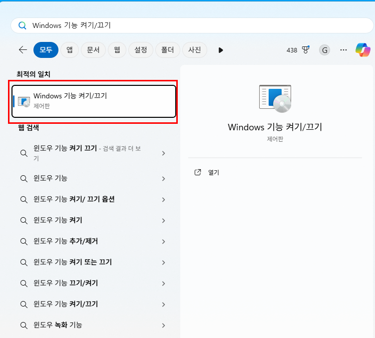
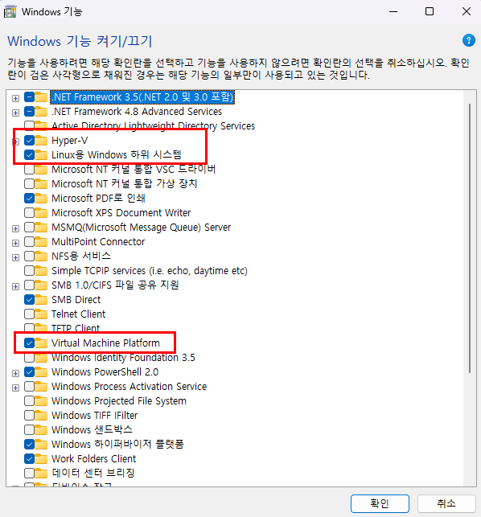
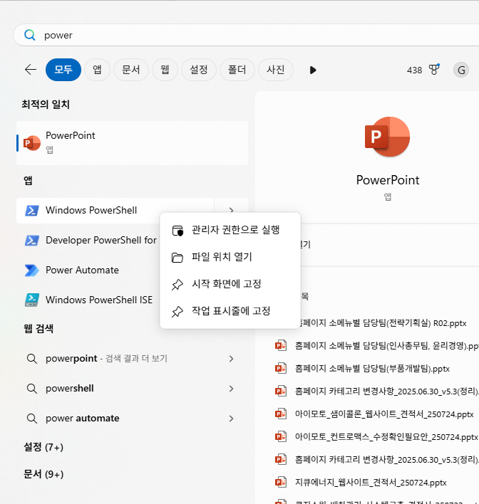
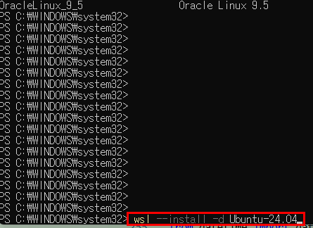
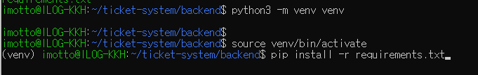
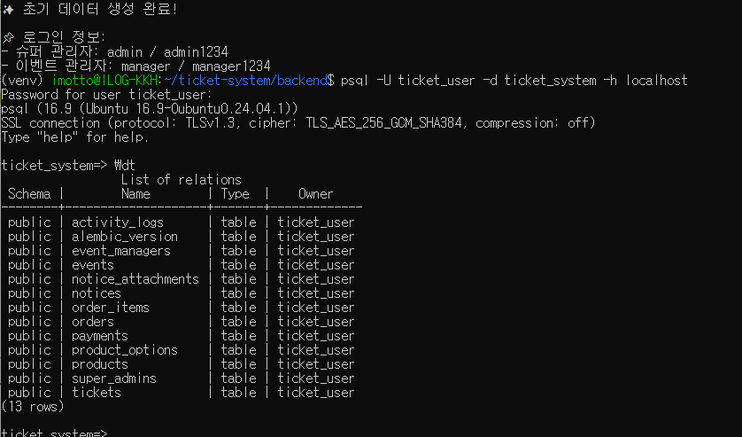

# 🐧 WSL + Ubuntu 24.04 + FastAPI 백엔드 개발 환경 구축 가이드

> 전시회 티켓 예약 시스템 (FastAPI 백엔드) 개발을 위한 WSL 기반 환경 셋업

## ✅ 시스템 요구 사항

- OS: Ubuntu 24.04 LTS (8코어 32GB)
- Python: 3.12
- PostgreSQL: 16+
- Redis: 7+
- 프레임워크: FastAPI + SQLAlchemy (async) + Uvicorn/Gunicorn
- 기타: Alembic, Pydantic, JWT 인증

---

## ✅ 1. WSL 설치 전 준비사항 (Windows)

### 📌 Windows 기능 켜기 / 끄기 설정

아래 기능들을 반드시 활성화해야 합니다:

- [x] Windows Subsystem for Linux
- [x] Virtual Machine Platform
- [x] Hyper-V (Windows 10 Pro 이상 권장)


### 💡 설정 방법
1. **"Windows 기능 켜기 또는 끄기"** 실행 (`Win + S` → 검색)

2. 위 기능들 체크

3. **재부팅 필수**

---

## ✅ 2. WSL 설치 및 Ubuntu 24.04 설치

### 📌 PowerShell (관리자 권한) 실행




```powershell
wsl --install -d Ubuntu-24.04
```


### 📌 설치 후 초기 설정

- 사용자명 입력 : imotto
- 비밀번호 설정 : 1234


### 📌 설치된 배포판 확인

```powershell
wsl -l -v
```

예시:
```
  NAME            STATE           VERSION
* Ubuntu-24.04    Running         2
```

### 📌 기본 배포판 설정 (선택)

```powershell
wsl --set-default Ubuntu-24.04
```

---

## ✅ 3. Ubuntu 24.04 초기 세팅 (Power shell 관리자 실행 후 WSL 실행)

```bash

# WSL 진입 (PowerShell 관리자 실행 후)
wsl

# 1. 패키지 업데이트
sudo apt update && sudo apt upgrade -y

# 2. 필수 도구 설치 (빌드, 디버깅, 시스템)
sudo apt install -y curl wget git unzip make jq build-essential software-properties-common ca-certificates lsb-release gnupg

# 3. 개발용 C 라이브러리 (Python 확장 빌드용)
sudo apt install -y libffi-dev libssl-dev zlib1g-dev libjpeg-dev libpng-dev libfreetype6-dev libpq-dev libsqlite3-dev libbz2-dev libreadline-dev liblzma-dev uuid-dev tk-dev libncursesw5-dev xz-utils

# 4. Python 3.12 설치 (Ubuntu 24.04는 기본 제공)
sudo apt install -y python3.12 python3.12-venv python3.12-dev python3-pip

# 5. python 기본 명령어를 3.12로 설정
sudo ln -sf /usr/bin/python3.12 /usr/bin/python
sudo ln -sf /usr/bin/python3.12 /usr/bin/python3

# 6. pip 업그레이드
python -m pip install --upgrade pip

# 7. 버전확인
python --version     # → Python 3.12.x
python3 --version    # → Python 3.12.x
pip --version        # → pip 최신버전

# 8. 한국시간 으로 맞추기
sudo timedatectl set-timezone Asia/Seoul
timedatectl


---
```
## ✅ 4. 심볼릭링크 및 가상환경

```bash
# 프로젝트 디렉토리 생성
mkdir -p ~/ticket-system

# 홈 디렉토리에서 심볼릭 링크 생성 
# ※ 주의 : /mnt/d/projects/ticket-system/ <-- d:/projects/ticket-system 각자 윈도우 경로를 뜻함, 아래 내부 컴퓨터 프로젝트 경로는 각자 알맞게 바꿔야 함. 
ln -s "/mnt/d/projects/ticket-system/backend" ~/ticket-system/backend
ln -s "/mnt/d/projects/ticket-system/frontend" ~/ticket-system/frontend
```



```bash
# 디렉토리 이동
cd ~/ticket-system/backend

# 가상환경 생성 및 활성화
python3 -m venv venv # 이건 한번만 실행하면 됨 
source venv/bin/activate # wsl 접속 후 항상 입력하고 해줘야 함.

# 패키지 설치
pip install -r requirements.txt
```


---

## ✅ 6. PostgreSQL 설치 (로컬 개발용)

```bash
sudo apt install -y postgresql postgresql-contrib
sudo systemctl enable postgresql
sudo systemctl start postgresql
```

---

## ✅ 7. Redis 설치 (캐시 및 실시간 처리)

```bash
sudo apt install -y redis-server
sudo systemctl enable redis-server
sudo systemctl start redis-server

# 정상 확인
redis-cli ping  # → PONG
```

---

## ✅ 8-1. PostgreSQL DB 셋팅 (DB생성 / 유저생성)
```bash
# db 실행 체크
sudo service postgresql status
# 실행 안되어 있으면:
sudo service postgresql start

# PostgreSQL 접속 (기본 postgres 유저로)
sudo -u postgres psql

```
### postgreSQL 데이터 베이스 초기화
```bash
# 스크립트 실행 권한 부여
chmod +x scripts/init_db.sh

# 스크립트 실행
./scripts/init_db.sh

# 만약 스크립트가 실행이 안된다면 아래거 실행
sudo apt install -y dos2unix
dos2unix ./scripts/init_db.sh
chmod +x ./scripts/init_db.sh
head -n1 ./scripts/init_db.sh
bash -x ./scripts/init_db.sh
./init_db.sh
```


## ✅ 8-3. Alembic (DB 마이그레이션 도구)

```bash
# Alembic 설치
pip install alembic
```


### Alembic 마이그레이션 실행 (models 정의된 내용으로 DB 동기화)
```bash
# 기존 마이그레이션 파일 삭제 (있을 경우)
rm -rf alembic/versions/*

# 새 마이그레이션 생성
alembic revision --autogenerate -m "Initial migration"

# 마이그레이션 적용
alembic upgrade head

# 초기 데이터 생성
python scripts/create_initial_data.py

# db 정상 실행된지 체크 (비번 1234)
psql -U ticket_user -d ticket_system -h localhost

# db table 조회
\dt

```


## ✅ 8-4. api 실행
```bash
# 서버실행
uvicorn app.main:app --reload
```
http://localhost:8000/docs
API 문서: http://localhost:8000/docs
헬스체크: http://localhost:8000/health


---

## ✅ 11. 시스템 점검 체크리스트

| 항목             | 확인 명령어                |
|------------------|----------------------------|
| Python 버전      | `python3 --version`        |
| pip              | `pip --version`            |
| PostgreSQL 작동  | `psql --version`           |
| Redis 작동       | `redis-cli ping`           |
| FastAPI 실행     | `uvicorn app.main:app --reload` |
| Alembic 정상 작동| `alembic upgrade head`     |
| 테스트 실행      | `pytest`                   |

---

## ✅ 부가 팁

- VS Code에서 `Remote - WSL` 확장 설치 시 개발 편의성 극대화
- `.env` 파일은 `.env.example` 기반으로 복사하여 수정

---

## 🧼 WSL 배포판 삭제 방법

```powershell
wsl --unregister Ubuntu-24.04
```

또는 전체 삭제:

```powershell
Disable-WindowsOptionalFeature -Online -FeatureName Microsoft-Windows-Subsystem-Linux
Disable-WindowsOptionalFeature -Online -FeatureName VirtualMachinePlatform
```

---

> 작성일: 2025.07.28  
> 작성자: ChatGPT 환경 자동화 가이드