# 전시회 티켓 예약 시스템 - 데이터베이스 스키마 설계

> **프로젝트명**: ticket-system  
> **목표**: 다중 관리자 지원 고성능 티켓 예약 시스템  
> **작성일**: 2025.07.28  
> **버전**: v3.0 (간결하고 범용적인 설계)

## 📋 목차

1. [스키마 개요](#-스키마-개요)
2. [관리자 및 권한 테이블](#-관리자-및-권한-테이블)
3. [이벤트 및 상품 테이블](#-이벤트-및-상품-테이블)
4. [주문 및 결제 테이블](#-주문-및-결제-테이블)
5. [티켓 및 입장 테이블](#-티켓-및-입장-테이블)
6. [기타 테이블](#-기타-테이블)
7. [인덱스 최적화](#-인덱스-최적화)
8. [초기 데이터](#-초기-데이터)

---

## 🏗 스키마 개요

### 📊 테이블 관계도

```mermaid
erDiagram
    %% 관리자 및 권한 관련
    admins ||--o{ events : "creates"
    admins ||--o{ managers : "assigns"
    admins ||--o{ logs : "logs"
    
    managers ||--|| events : "manages"
    managers ||--o{ products : "manages"
    managers ||--o{ orders : "handles"
    managers ||--o{ logs : "logs"
    
    %% 이벤트 및 상품
    events ||--o{ products : "contains"
    events ||--o{ notices : "has"
    events ||--o{ stats : "summarizes"
    
    products ||--o{ options : "has"
    products ||--o{ items : "ordered_as"
    
    options ||--o{ items : "selected_as"
    
    %% 주문 관련
    members ||--o{ orders : "places"
    orders ||--o{ items : "contains"
    orders ||--o{ payments : "paid_by"
    orders ||--o{ tickets : "generates"
    
    %% 공지사항 및 파일
    notices ||--o{ files : "includes"
    events ||--o{ files : "has_images"
    
    %% 입장 관리
    tickets ||--o{ entrances : "tracked"
    managers ||--o{ entrances : "processed_by"

    %% 테이블 정의
    admins {
        int id PK
        string username UK
        string email UK
        string password
        string name
        string phone
        smallint level
        char status
        timestamp login_at
        timestamp created_at
        timestamp updated_at
    }
    
    events {
        int id PK
        string code UK
        string name
        text description
        string venue
        string image
        date start_date
        date end_date
        char status
        int admin_id FK
        timestamp created_at
        timestamp updated_at
    }
    
    managers {
        int id PK
        int event_id FK
        string username UK
        string email UK
        string password
        string name
        string phone
        smallint level
        char status
        int admin_id FK
        timestamp login_at
        timestamp created_at
        timestamp updated_at
    }
    
    members {
        int id PK
        string name
        string phone UK
        string email
        text memo
        timestamp created_at
        timestamp updated_at
    }
    
    products {
        int id PK
        int event_id FK
        string name
        text description
        int price
        int stock
        int sold
        int sort
        char status
        int admin_id
        timestamp created_at
        timestamp updated_at
    }
    
    options {
        int id PK
        int product_id FK
        string name
        int price_add
        int stock
        int sold
        int sort
        char status
        timestamp created_at
        timestamp updated_at
    }
    
    orders {
        int id PK
        int event_id FK
        int member_id FK
        string order_no UK
        int amount
        string status
        date visit_date
        text memo
        timestamp created_at
        timestamp updated_at
    }
    
    items {
        int id PK
        int order_id FK
        int product_id FK
        int option_id FK
        string name
        int price
        int quantity
        int amount
        timestamp created_at
    }
    
    payments {
        int id PK
        int order_id FK
        string pay_key UK
        string method
        int amount
        string status
        string pg_tid
        json pg_data
        timestamp paid_at
        timestamp created_at
        timestamp updated_at
    }
    
    tickets {
        int id PK
        int order_id FK
        int item_id FK
        string code UK
        string type
        char used
        timestamp used_at
        int used_by
        timestamp created_at
    }
    
    notices {
        int id PK
        int event_id FK
        string title
        text content
        int hit
        char pin
        char status
        int admin_id
        timestamp created_at
        timestamp updated_at
    }
    
    files {
        int id PK
        string table_name
        int table_id
        string name
        string path
        int size
        string type
        int sort
        int downloads
        timestamp created_at
    }
    
    entrances {
        int id PK
        int ticket_id FK
        int manager_id
        string type
        string device
        text memo
        timestamp created_at
    }
    
    logs {
        bigint id
        int user_id
        string user_type
        int event_id
        string action
        string target
        int target_id
        json data
        inet ip
        text agent
        timestamp created_at
    }
    
    stats {
        int id PK
        int event_id FK
        date date
        int orders
        int sales
        int tickets
        int entrances
        timestamp created_at
    }
```



### 🎯 설계 원칙

1. **다중 테넌시**: 각 이벤트가 독립적으로 운영
2. **권한 기반 접근**: 단순화된 권한 레벨 시스템  
3. **상태 관리**: 단일 문자 상태 코드로 간결한 관리
4. **활동 추적**: 모든 관리자 활동 로그 기록
5. **성능 최적화**: 필수 인덱스와 파티셔닝
6. **확장성**: 범용적인 테이블 구조로 유연한 확장

---

## 👥 관리자 및 권한 테이블

### 1. 관리자 테이블 (admins) - 슈퍼 관리자

```sql
CREATE TABLE admins (
    id SERIAL PRIMARY KEY,
    username VARCHAR(30) UNIQUE NOT NULL,
    email VARCHAR(100) UNIQUE NOT NULL,
    password VARCHAR(255) NOT NULL,
    name VARCHAR(50) NOT NULL,
    phone VARCHAR(20),
    level SMALLINT DEFAULT 10, -- 10: 슈퍼관리자
    status CHAR(1) DEFAULT 'Y', -- Y: 활성, N: 비활성, D: 삭제
    login_at TIMESTAMP,
    created_at TIMESTAMP DEFAULT CURRENT_TIMESTAMP,
    updated_at TIMESTAMP DEFAULT CURRENT_TIMESTAMP
);

-- 인덱스
CREATE INDEX idx_admins_status ON admins(status) WHERE status = 'Y';
CREATE INDEX idx_admins_level ON admins(level);

-- 트리거: updated_at 자동 업데이트
CREATE OR REPLACE FUNCTION update_updated_at_column()
RETURNS TRIGGER AS $
BEGIN
    NEW.updated_at = CURRENT_TIMESTAMP;
    RETURN NEW;
END;
$ language 'plpgsql';

CREATE TRIGGER update_admins_updated_at 
    BEFORE UPDATE ON admins 
    FOR EACH ROW EXECUTE FUNCTION update_updated_at_column();
```

### 2. 이벤트 관리자 테이블 (managers)

```sql
CREATE TABLE managers (
    id SERIAL PRIMARY KEY,
    event_id INTEGER NOT NULL REFERENCES events(id),
    username VARCHAR(30) UNIQUE NOT NULL,
    email VARCHAR(100) UNIQUE NOT NULL,
    password VARCHAR(255) NOT NULL,
    name VARCHAR(50) NOT NULL,
    phone VARCHAR(20),
    level SMALLINT DEFAULT 1, -- 1: 일반, 2: 매니저, 3: 책임자
    status CHAR(1) DEFAULT 'Y', -- Y: 활성, N: 비활성, D: 삭제
    admin_id INTEGER REFERENCES admins(id), -- 생성한 관리자
    login_at TIMESTAMP,
    created_at TIMESTAMP DEFAULT CURRENT_TIMESTAMP,
    updated_at TIMESTAMP DEFAULT CURRENT_TIMESTAMP
);

-- 인덱스
CREATE UNIQUE INDEX idx_managers_username ON managers(username) WHERE status != 'D';
CREATE INDEX idx_managers_event_status ON managers(event_id, status);
CREATE INDEX idx_managers_level ON managers(level);

-- 트리거
CREATE TRIGGER update_managers_updated_at 
    BEFORE UPDATE ON managers 
    FOR EACH ROW EXECUTE FUNCTION update_updated_at_column();
```

---

## 🎪 이벤트 및 상품 테이블

### 3. 이벤트 테이블 (events)

```sql
CREATE TABLE events (
    id SERIAL PRIMARY KEY,
    code VARCHAR(20) UNIQUE NOT NULL,
    name VARCHAR(200) NOT NULL,
    description TEXT,
    venue VARCHAR(200), -- 장소
    image VARCHAR(500),
    start_date DATE NOT NULL,
    end_date DATE NOT NULL,
    status CHAR(1) DEFAULT 'Y', -- Y: 활성, N: 비활성, D: 삭제, E: 종료
    admin_id INTEGER REFERENCES admins(id),
    created_at TIMESTAMP DEFAULT CURRENT_TIMESTAMP,
    updated_at TIMESTAMP DEFAULT CURRENT_TIMESTAMP
);

-- 인덱스
CREATE UNIQUE INDEX idx_events_code ON events(code) WHERE status != 'D';
CREATE INDEX idx_events_dates ON events(start_date, end_date) WHERE status = 'Y';
CREATE INDEX idx_events_status ON events(status);

-- 트리거
CREATE TRIGGER update_events_updated_at 
    BEFORE UPDATE ON events 
    FOR EACH ROW EXECUTE FUNCTION update_updated_at_column();

-- 제약조건
ALTER TABLE events ADD CONSTRAINT chk_events_date_range 
    CHECK (end_date >= start_date);
```

### 4. 회원 테이블 (members) - 구매자

```sql
CREATE TABLE members (
    id SERIAL PRIMARY KEY,
    name VARCHAR(50) NOT NULL,
    phone VARCHAR(20) UNIQUE NOT NULL,
    email VARCHAR(100),
    memo TEXT,
    created_at TIMESTAMP DEFAULT CURRENT_TIMESTAMP,
    updated_at TIMESTAMP DEFAULT CURRENT_TIMESTAMP
);

-- 인덱스
CREATE INDEX idx_members_phone ON members(phone);
CREATE INDEX idx_members_email ON members(email) WHERE email IS NOT NULL;

-- 트리거
CREATE TRIGGER update_members_updated_at 
    BEFORE UPDATE ON members 
    FOR EACH ROW EXECUTE FUNCTION update_updated_at_column();
```

### 5. 상품 테이블 (products)

```sql
CREATE TABLE products (
    id SERIAL PRIMARY KEY,
    event_id INTEGER NOT NULL REFERENCES events(id),
    name VARCHAR(200) NOT NULL,
    description TEXT,
    price INTEGER NOT NULL DEFAULT 0,
    stock INTEGER NOT NULL DEFAULT 0,
    sold INTEGER NOT NULL DEFAULT 0,
    sort INTEGER DEFAULT 0, -- 정렬 순서
    status CHAR(1) DEFAULT 'Y', -- Y: 판매중, N: 판매중지, D: 삭제
    admin_id INTEGER NOT NULL, -- 생성한 관리자
    created_at TIMESTAMP DEFAULT CURRENT_TIMESTAMP,
    updated_at TIMESTAMP DEFAULT CURRENT_TIMESTAMP
);

-- 인덱스
CREATE INDEX idx_products_event_status ON products(event_id, status);
CREATE INDEX idx_products_sort ON products(event_id, sort, id);

-- 트리거
CREATE TRIGGER update_products_updated_at 
    BEFORE UPDATE ON products 
    FOR EACH ROW EXECUTE FUNCTION update_updated_at_column();

-- 제약조건
ALTER TABLE products ADD CONSTRAINT chk_products_price_positive 
    CHECK (price >= 0);
ALTER TABLE products ADD CONSTRAINT chk_products_stock_non_negative 
    CHECK (stock >= 0 AND sold >= 0);
```

### 6. 상품 옵션 테이블 (options)

```sql
CREATE TABLE options (
    id SERIAL PRIMARY KEY,
    product_id INTEGER NOT NULL REFERENCES products(id),
    name VARCHAR(100) NOT NULL, -- 옵션명 (성인, 청소년, 어린이 등)
    price_add INTEGER DEFAULT 0, -- 추가금액 (음수 가능)
    stock INTEGER NOT NULL DEFAULT 0,
    sold INTEGER NOT NULL DEFAULT 0,
    sort INTEGER DEFAULT 0,
    status CHAR(1) DEFAULT 'Y', -- Y: 활성, N: 비활성, D: 삭제
    created_at TIMESTAMP DEFAULT CURRENT_TIMESTAMP,
    updated_at TIMESTAMP DEFAULT CURRENT_TIMESTAMP
);

-- 인덱스
CREATE INDEX idx_options_product_status ON options(product_id, status);
CREATE INDEX idx_options_sort ON options(product_id, sort, id);

-- 트리거
CREATE TRIGGER update_options_updated_at 
    BEFORE UPDATE ON options 
    FOR EACH ROW EXECUTE FUNCTION update_updated_at_column();

-- 제약조건
ALTER TABLE options ADD CONSTRAINT chk_options_stock_non_negative 
    CHECK (stock >= 0 AND sold >= 0);
```

---

## 🛍 주문 및 결제 테이블

### 7. 주문 테이블 (orders)

```sql
CREATE TABLE orders (
    id SERIAL PRIMARY KEY,
    event_id INTEGER NOT NULL REFERENCES events(id),
    member_id INTEGER NOT NULL REFERENCES members(id),
    order_no VARCHAR(30) UNIQUE NOT NULL, -- 주문번호
    amount INTEGER NOT NULL, -- 총 금액
    status VARCHAR(20) DEFAULT 'pending', -- pending, paid, cancelled, refunded
    visit_date DATE NOT NULL, -- 방문 예정일
    memo TEXT,
    created_at TIMESTAMP DEFAULT CURRENT_TIMESTAMP,
    updated_at TIMESTAMP DEFAULT CURRENT_TIMESTAMP
);

-- 인덱스
CREATE INDEX idx_orders_event_status ON orders(event_id, status);
CREATE INDEX idx_orders_member ON orders(member_id);
CREATE INDEX idx_orders_visit ON orders(visit_date);
CREATE INDEX idx_orders_created ON orders(created_at DESC);

-- 트리거
CREATE TRIGGER update_orders_updated_at 
    BEFORE UPDATE ON orders 
    FOR EACH ROW EXECUTE FUNCTION update_updated_at_column();

-- 제약조건
ALTER TABLE orders ADD CONSTRAINT chk_orders_amount_positive 
    CHECK (amount >= 0);
ALTER TABLE orders ADD CONSTRAINT chk_orders_status 
    CHECK (status IN ('pending', 'paid', 'cancelled', 'refunded'));
```

### 8. 주문 상품 테이블 (items)

```sql
CREATE TABLE items (
    id SERIAL PRIMARY KEY,
    order_id INTEGER NOT NULL REFERENCES orders(id),
    product_id INTEGER NOT NULL REFERENCES products(id),
    option_id INTEGER REFERENCES options(id),
    name VARCHAR(200) NOT NULL, -- 상품명 (구매 시점)
    price INTEGER NOT NULL, -- 단가 (구매 시점)
    quantity INTEGER NOT NULL DEFAULT 1,
    amount INTEGER NOT NULL, -- 소계
    created_at TIMESTAMP DEFAULT CURRENT_TIMESTAMP
);

-- 인덱스
CREATE INDEX idx_items_order ON items(order_id);
CREATE INDEX idx_items_product ON items(product_id);

-- 제약조건
ALTER TABLE items ADD CONSTRAINT chk_items_quantity_positive 
    CHECK (quantity > 0);
ALTER TABLE items ADD CONSTRAINT chk_items_price_positive 
    CHECK (price >= 0 AND amount >= 0);
```

### 9. 결제 테이블 (payments)

```sql
CREATE TABLE payments (
    id SERIAL PRIMARY KEY,
    order_id INTEGER NOT NULL REFERENCES orders(id),
    pay_key VARCHAR(100) UNIQUE NOT NULL, -- 결제 고유키
    method VARCHAR(30) NOT NULL, -- card, transfer, virtual
    amount INTEGER NOT NULL,
    status VARCHAR(20) DEFAULT 'pending', -- pending, success, failed, cancelled
    pg_tid VARCHAR(100), -- PG사 거래번호
    pg_data JSONB, -- PG사 응답 데이터
    paid_at TIMESTAMP,
    created_at TIMESTAMP DEFAULT CURRENT_TIMESTAMP,
    updated_at TIMESTAMP DEFAULT CURRENT_TIMESTAMP
);

-- 인덱스
CREATE INDEX idx_payments_order ON payments(order_id);
CREATE INDEX idx_payments_status ON payments(status);

-- 트리거
CREATE TRIGGER update_payments_updated_at 
    BEFORE UPDATE ON payments 
    FOR EACH ROW EXECUTE FUNCTION update_updated_at_column();

-- 제약조건
ALTER TABLE payments ADD CONSTRAINT chk_payments_amount_positive 
    CHECK (amount >= 0);
ALTER TABLE payments ADD CONSTRAINT chk_payments_status 
    CHECK (status IN ('pending', 'success', 'failed', 'cancelled'));
```

---

## 🎫 티켓 및 입장 테이블

### 10. 티켓 테이블 (tickets)

```sql
CREATE TABLE tickets (
    id SERIAL PRIMARY KEY,
    order_id INTEGER NOT NULL REFERENCES orders(id),
    item_id INTEGER NOT NULL REFERENCES items(id),
    code VARCHAR(50) UNIQUE NOT NULL, -- QR 코드
    type VARCHAR(30) NOT NULL, -- 티켓 유형
    used CHAR(1) DEFAULT 'N', -- Y: 사용, N: 미사용
    used_at TIMESTAMP,
    used_by INTEGER, -- 사용 처리한 관리자
    created_at TIMESTAMP DEFAULT CURRENT_TIMESTAMP
);

-- 인덱스
CREATE INDEX idx_tickets_order ON tickets(order_id);
CREATE INDEX idx_tickets_used ON tickets(used, used_at);
```

### 11. 입장 기록 테이블 (entrances)

```sql
CREATE TABLE entrances (
    id SERIAL PRIMARY KEY,
    ticket_id INTEGER NOT NULL REFERENCES tickets(id),
    manager_id INTEGER NOT NULL, -- 처리한 관리자
    type VARCHAR(20) DEFAULT 'normal', -- normal, vip, comp
    device VARCHAR(100), -- 스캔 디바이스 정보
    memo TEXT,
    created_at TIMESTAMP DEFAULT CURRENT_TIMESTAMP
);

-- 인덱스
CREATE INDEX idx_entrances_ticket ON entrances(ticket_id);
CREATE INDEX idx_entrances_created ON entrances(created_at DESC);

-- 제약조건
ALTER TABLE entrances ADD CONSTRAINT chk_entrances_type 
    CHECK (type IN ('normal', 'vip', 'comp'));
```

---

## 📄 기타 테이블

### 12. 공지사항 테이블 (notices)

```sql
CREATE TABLE notices (
    id SERIAL PRIMARY KEY,
    event_id INTEGER NOT NULL REFERENCES events(id),
    title VARCHAR(300) NOT NULL,
    content TEXT NOT NULL,
    hit INTEGER DEFAULT 0, -- 조회수
    pin CHAR(1) DEFAULT 'N', -- Y: 상단고정
    status CHAR(1) DEFAULT 'Y', -- Y: 게시, N: 미게시
    admin_id INTEGER NOT NULL, -- 작성자
    created_at TIMESTAMP DEFAULT CURRENT_TIMESTAMP,
    updated_at TIMESTAMP DEFAULT CURRENT_TIMESTAMP
);

-- 인덱스
CREATE INDEX idx_notices_event_status ON notices(event_id, status);
CREATE INDEX idx_notices_pin ON notices(event_id, pin, id DESC);

-- 트리거
CREATE TRIGGER update_notices_updated_at 
    BEFORE UPDATE ON notices 
    FOR EACH ROW EXECUTE FUNCTION update_updated_at_column();
```

### 13. 첨부파일 테이블 (files) - 범용

```sql
CREATE TABLE files (
    id SERIAL PRIMARY KEY,
    table_name VARCHAR(30) NOT NULL, -- notices, events 등
    table_id INTEGER NOT NULL, -- 해당 테이블의 ID
    name VARCHAR(255) NOT NULL, -- 원본 파일명
    path VARCHAR(500) NOT NULL, -- 저장 경로
    size INTEGER NOT NULL,
    type VARCHAR(100), -- MIME type
    sort INTEGER DEFAULT 0,
    downloads INTEGER DEFAULT 0, -- 다운로드 수
    created_at TIMESTAMP DEFAULT CURRENT_TIMESTAMP
);

-- 인덱스
CREATE INDEX idx_files_table ON files(table_name, table_id);
```

### 14. 활동 로그 테이블 (logs) - 파티셔닝

```sql
CREATE TABLE logs (
    id BIGSERIAL,
    user_id INTEGER NOT NULL,
    user_type VARCHAR(20) NOT NULL, -- admin, manager
    event_id INTEGER,
    action VARCHAR(50) NOT NULL, -- login, logout, create, update, delete
    target VARCHAR(50), -- 대상 테이블
    target_id INTEGER, -- 대상 ID
    data JSONB, -- 변경 데이터
    ip INET,
    agent TEXT,
    created_at TIMESTAMP DEFAULT CURRENT_TIMESTAMP
) PARTITION BY RANGE (created_at);

-- 월별 파티션
CREATE TABLE logs_2025_07 PARTITION OF logs
    FOR VALUES FROM ('2025-07-01') TO ('2025-08-01');

-- 인덱스
CREATE INDEX idx_logs_user ON logs(user_id, user_type);
CREATE INDEX idx_logs_event ON logs(event_id) WHERE event_id IS NOT NULL;
CREATE INDEX idx_logs_created ON logs(created_at DESC);
```

### 15. 통계 요약 테이블 (stats) - 성능 최적화

```sql
CREATE TABLE stats (
    id SERIAL PRIMARY KEY,
    event_id INTEGER NOT NULL REFERENCES events(id),
    date DATE NOT NULL,
    orders INTEGER DEFAULT 0, -- 주문 수
    sales INTEGER DEFAULT 0, -- 매출액
    tickets INTEGER DEFAULT 0, -- 발권 수
    entrances INTEGER DEFAULT 0, -- 입장 수
    created_at TIMESTAMP DEFAULT CURRENT_TIMESTAMP,
    UNIQUE(event_id, date)
);

-- 인덱스
CREATE INDEX idx_stats_event_date ON stats(event_id, date DESC);
```

---

## 🚀 인덱스 최적화

### 복합 인덱스 전략

```sql
-- 이벤트별 활성 상품 조회 최적화
CREATE INDEX idx_products_event_active_stock ON products(event_id, status, stock);

-- 주문 조회 최적화 (관리자 대시보드용)
CREATE INDEX idx_orders_event_status_date ON orders(event_id, status, visit_date DESC);

-- 티켓 사용 통계 최적화
CREATE INDEX idx_tickets_order_used ON tickets(order_id, used, used_at);

-- 관리자 활동 추적 최적화
CREATE INDEX idx_logs_event_user_date ON logs(event_id, user_id, created_at DESC);

-- 실시간 재고 조회 최적화
CREATE INDEX idx_options_product_active_stock ON options(product_id, status, stock);
```

### 파티셔닝 전략

```sql
-- 활동 로그 테이블 월별 파티셔닝
ALTER TABLE logs PARTITION BY RANGE (created_at);

-- 입장 로그 테이블 월별 파티셔닝  
CREATE TABLE entrances_2025_07 PARTITION OF entrances
    FOR VALUES FROM ('2025-07-01') TO ('2025-08-01');

-- 파티션 자동 생성 함수
CREATE OR REPLACE FUNCTION create_monthly_partitions()
RETURNS void AS $
DECLARE
    start_date DATE;
    end_date DATE;
    partition_name TEXT;
BEGIN
    start_date := DATE_TRUNC('month', CURRENT_DATE);
    end_date := start_date + INTERVAL '1 month';
    
    -- logs 파티션
    partition_name := 'logs_' || TO_CHAR(start_date, 'YYYY_MM');
    EXECUTE format('CREATE TABLE IF NOT EXISTS %I PARTITION OF logs
        FOR VALUES FROM (%L) TO (%L)', partition_name, start_date, end_date);
    
    -- entrances 파티션
    partition_name := 'entrances_' || TO_CHAR(start_date, 'YYYY_MM');
    EXECUTE format('CREATE TABLE IF NOT EXISTS %I PARTITION OF entrances
        FOR VALUES FROM (%L) TO (%L)', partition_name, start_date, end_date);
END;
$ LANGUAGE plpgsql;

-- 매월 실행
SELECT cron.schedule('create-partitions', '0 0 1 * *', 'SELECT create_monthly_partitions()');
```

---

## 📊 초기 데이터

### 슈퍼 관리자 초기 계정

```sql
-- 슈퍼 관리자 초기 계정 생성
INSERT INTO admins (username, email, password, name, level) VALUES
('superadmin', 'super@ticket-system.com', '$2b$12$example_hashed_password', '시스템 관리자', 10),
('admin', 'admin@ticket-system.com', '$2b$12$example_hashed_password', '운영 관리자', 10);
```

### 테스트 이벤트 데이터

```sql
-- 테스트 이벤트 생성
INSERT INTO events (code, name, description, venue, start_date, end_date, admin_id) VALUES
('AAA', '서울 아트 페어 2025', '2025년 서울에서 열리는 대규모 아트 페어', '서울 코엑스', '2025-08-01', '2025-08-10', 1),
('BBB', '부산 음악 축제 2025', '2025년 부산에서 열리는 K-POP 음악 축제', '부산 해운대 해수욕장', '2025-09-15', '2025-09-17', 1),
('CCC', '대구 푸드 페스티벌 2025', '2025년 대구 특색 음식 축제', '대구 광장', '2025-10-05', '2025-10-07', 1);

-- 테스트 관리자 계정 생성
INSERT INTO managers (event_id, username, email, password, name, level, admin_id) VALUES
(1, 'manager_aaa', 'manager.aaa@ticket-system.com', '$2b$12$example_hashed_password', 'AAA 이벤트 담당자', 3, 1),
(2, 'manager_bbb', 'manager.bbb@ticket-system.com', '$2b$12$example_hashed_password', 'BBB 이벤트 담당자', 3, 1),
(3, 'manager_ccc', 'manager.ccc@ticket-system.com', '$2b$12$example_hashed_password', 'CCC 이벤트 담당자', 3, 1),
(1, 'staff_aaa', 'staff.aaa@ticket-system.com', '$2b$12$example_hashed_password', 'AAA 이벤트 스태프', 2, 1);
```

### 테스트 상품 데이터

```sql
-- AAA 이벤트 상품
INSERT INTO products (event_id, name, description, price, stock, admin_id) VALUES
(1, 'AAA 일반 입장권', '서울 아트 페어 일반 입장권', 25000, 5000, 1),
(1, 'AAA VIP 입장권', '서울 아트 페어 VIP 입장권 (전용 라운지 이용 가능)', 50000, 500, 1);

-- BBB 이벤트 상품
INSERT INTO products (event_id, name, description, price, stock, admin_id) VALUES
(2, 'BBB 1일권', '부산 음악 축제 1일 입장권', 80000, 10000, 2),
(2, 'BBB 3일권', '부산 음악 축제 3일 패키지 입장권', 200000, 3000, 2);

-- CCC 이벤트 상품
INSERT INTO products (event_id, name, description, price, stock, admin_id) VALUES
(3, 'CCC 일반권', '대구 푸드 페스티벌 일반 입장권', 15000, 8000, 3),
(3, 'CCC 시식권', '대구 푸드 페스티벌 시식 체험권', 30000, 2000, 3);
```

### 상품 옵션 데이터

```sql
-- AAA 일반 입장권 옵션
INSERT INTO options (product_id, name, price_add, stock) VALUES
(1, '성인', 0, 3000),
(1, '청소년', -5000, 1000),
(1, '어린이', -10000, 1000);

-- AAA VIP 입장권 옵션
INSERT INTO options (product_id, name, price_add, stock) VALUES
(2, '성인', 0, 400),
(2, '청소년', -10000, 100);

-- BBB 1일권 옵션
INSERT INTO options (product_id, name, price_add, stock) VALUES
(3, '성인', 0, 6000),
(3, '청소년', -20000, 2000),
(3, '어린이', -30000, 2000);

-- BBB 3일권 옵션
INSERT INTO options (product_id, name, price_add, stock) VALUES
(4, '성인', 0, 2000),
(4, '청소년', -50000, 1000);

-- CCC 일반권 옵션
INSERT INTO options (product_id, name, price_add, stock) VALUES
(5, '성인', 0, 5000),
(5, '청소년', -3000, 1500),
(5, '어린이', -5000, 1500);

-- CCC 시식권 옵션
INSERT INTO options (product_id, name, price_add, stock) VALUES
(6, '성인', 0, 1500),
(6, '청소년', -5000, 500);
```

### 테스트 공지사항 데이터

```sql
-- 이벤트별 공지사항
INSERT INTO notices (event_id, title, content, pin, admin_id) VALUES
(1, '서울 아트 페어 2025 개최 안내', '올해로 5회째를 맞는 서울 아트 페어가 8월 1일부터 10일까지 개최됩니다. 많은 관심과 참여 부탁드립니다.', 'Y', 1),
(1, '주차장 이용 안내', '행사 기간 중 주차장이 혼잡할 수 있으니 대중교통 이용을 권장합니다.', 'N', 1),
(2, '부산 음악 축제 2025 라인업 공개', 'BTS, 블랙핑크, 뉴진스 등 최고의 K-POP 아티스트들이 함께합니다!', 'Y', 2),
(2, '우천 시 진행 안내', '소나기 정도의 비는 진행하며, 태풍 등 악천후 시에는 일정이 변경될 수 있습니다.', 'N', 2),
(3, '대구 푸드 페스티벌 참여 업체 소개', '대구 지역 유명 맛집 50여 곳이 참여하여 특별한 메뉴를 선보입니다.', 'Y', 3);
```

---

## 🚀 다음 단계

이 데이터베이스 스키마를 기반으로 다음 문서들을 작성할 예정입니다:

1. **[백엔드 API 및 서비스](ticket_backend.md)** - FastAPI 구조와 권한 기반 API 설계
2. **[프론트엔드 구조 및 컴포넌트](ticket_frontend.md)** - Next.js 페이지 구조와 권한별 UI
3. **[성능 최적화 및 보안](ticket_performance.md)** - 고성능 시스템 구현 방법

데이터베이스 스키마가 v3.0으로 업데이트되었습니다! 💪

---

**작성일**: 2025.07.28  
**작성자**: ilogini용을 권장합니다.', false, 1),
(2, '부산 음악 축제 2025 라인업 공개', 'BTS, 블랙핑크, 뉴진스 등 최고의 K-POP 아티스트들이 함께합니다!', true, 2),
(2, '우천 시 진행 안내', '소나기 정도의 비는 진행하며, 태풍 등 악천후 시에는 일정이 변경될 수 있습니다.', false, 2),
(3, '대구 푸드 페스티벌 참여 업체 소개', '대구 지역 유명 맛집 50여 곳이 참여하여 특별한 메뉴를 선보입니다.', true, 3);
```

---

## 🛠 마이그레이션 스크립트

### 완전한 데이터베이스 생성 스크립트

```sql
-- ticket_system 데이터베이스 전체 생성 스크립트
-- 실행 순서: PostgreSQL 연결 후 실행

-- 1. 확장 기능 활성화
CREATE EXTENSION IF NOT EXISTS "uuid-ossp";
CREATE EXTENSION IF NOT EXISTS "pgcrypto";

-- 2. 공통 함수 생성
CREATE OR REPLACE FUNCTION update_updated_at_column()
RETURNS TRIGGER AS $
BEGIN
    NEW.updated_at = CURRENT_TIMESTAMP;
    RETURN NEW;
END;
$ language 'plpgsql';

-- 3. 슈퍼 관리자 테이블
CREATE TABLE super_admins (
    id SERIAL PRIMARY KEY,
    username VARCHAR(50) UNIQUE NOT NULL,
    email VARCHAR(100) UNIQUE NOT NULL,
    password_hash VARCHAR(255) NOT NULL,
    full_name VARCHAR(100) NOT NULL,
    is_active BOOLEAN DEFAULT true,
    created_at TIMESTAMP DEFAULT CURRENT_TIMESTAMP,
    updated_at TIMESTAMP DEFAULT CURRENT_TIMESTAMP
);

CREATE INDEX idx_super_admins_username ON super_admins(username);
CREATE INDEX idx_super_admins_email ON super_admins(email);
CREATE INDEX idx_super_admins_active ON super_admins(is_active);

CREATE TRIGGER update_super_admins_updated_at 
    BEFORE UPDATE ON super_admins 
    FOR EACH ROW EXECUTE FUNCTION update_updated_at_column();

-- 4. 이벤트 테이블
CREATE TABLE events (
    id SERIAL PRIMARY KEY,
    event_code VARCHAR(20) UNIQUE NOT NULL,
    title VARCHAR(200) NOT NULL,
    description TEXT,
    image_url VARCHAR(500),
    start_date DATE NOT NULL,
    end_date DATE NOT NULL,
    is_active BOOLEAN DEFAULT true,
    is_deleted CHAR(1) DEFAULT 'N',
    created_by INTEGER REFERENCES super_admins(id),
    created_at TIMESTAMP DEFAULT CURRENT_TIMESTAMP,
    updated_at TIMESTAMP DEFAULT CURRENT_TIMESTAMP
);

CREATE UNIQUE INDEX idx_events_code_active ON events(event_code) WHERE is_deleted = 'N';
CREATE INDEX idx_events_active ON events(is_active, is_deleted);
CREATE INDEX idx_events_date_range ON events(start_date, end_date);
CREATE INDEX idx_events_created_by ON events(created_by);

CREATE TRIGGER update_events_updated_at 
    BEFORE UPDATE ON events 
    FOR EACH ROW EXECUTE FUNCTION update_updated_at_column();

ALTER TABLE events ADD CONSTRAINT chk_events_date_range 
    CHECK (end_date >= start_date);
ALTER TABLE events ADD CONSTRAINT chk_events_is_deleted 
    CHECK (is_deleted IN ('Y', 'N'));

-- 5. 이벤트 관리자 테이블
CREATE TABLE event_managers (
    id SERIAL PRIMARY KEY,
    event_id INTEGER NOT NULL REFERENCES events(id),
    username VARCHAR(50) UNIQUE NOT NULL,
    email VARCHAR(100) UNIQUE NOT NULL,
    password_hash VARCHAR(255) NOT NULL,
    full_name VARCHAR(100) NOT NULL,
    permission_level INTEGER DEFAULT 2,
    is_active BOOLEAN DEFAULT true,
    is_deleted CHAR(1) DEFAULT 'N',
    created_by INTEGER REFERENCES super_admins(id),
    created_at TIMESTAMP DEFAULT CURRENT_TIMESTAMP,
    updated_at TIMESTAMP DEFAULT CURRENT_TIMESTAMP
);

CREATE UNIQUE INDEX idx_event_managers_username_active ON event_managers(username) WHERE is_deleted = 'N';
CREATE UNIQUE INDEX idx_event_managers_email_active ON event_managers(email) WHERE is_deleted = 'N';
CREATE INDEX idx_event_managers_event ON event_managers(event_id, is_deleted);
CREATE INDEX idx_event_managers_permission ON event_managers(permission_level);
CREATE INDEX idx_event_managers_active ON event_managers(is_active, is_deleted);

CREATE TRIGGER update_event_managers_updated_at 
    BEFORE UPDATE ON event_managers 
    FOR EACH ROW EXECUTE FUNCTION update_updated_at_column();

ALTER TABLE event_managers ADD CONSTRAINT chk_event_managers_permission 
    CHECK (permission_level BETWEEN 1 AND 9);
ALTER TABLE event_managers ADD CONSTRAINT chk_event_managers_is_deleted 
    CHECK (is_deleted IN ('Y', 'N'));

COMMENT ON COLUMN event_managers.permission_level IS '1:조회전용, 2:일반관리자, 3:담당자, 9:슈퍼관리자';

-- 6. 고객 테이블
CREATE TABLE customers (
    id SERIAL PRIMARY KEY,
    name VARCHAR(100) NOT NULL,
    phone VARCHAR(20) UNIQUE NOT NULL,
    email VARCHAR(100),
    created_at TIMESTAMP DEFAULT CURRENT_TIMESTAMP,
    updated_at TIMESTAMP DEFAULT CURRENT_TIMESTAMP
);

CREATE UNIQUE INDEX idx_customers_phone ON customers(phone);
CREATE INDEX idx_customers_email ON customers(email);
CREATE INDEX idx_customers_name ON customers(name);

CREATE TRIGGER update_customers_updated_at 
    BEFORE UPDATE ON customers 
    FOR EACH ROW EXECUTE FUNCTION update_updated_at_column();

-- 7. 상품 테이블
CREATE TABLE products (
    id SERIAL PRIMARY KEY,
    event_id INTEGER NOT NULL REFERENCES events(id),
    name VARCHAR(200) NOT NULL,
    description TEXT,
    base_price DECIMAL(10, 2) NOT NULL,
    base_stock INTEGER NOT NULL DEFAULT 0,
    current_stock INTEGER NOT NULL DEFAULT 0,
    is_active BOOLEAN DEFAULT true,
    is_deleted CHAR(1) DEFAULT 'N',
    created_by INTEGER NOT NULL,
    created_at TIMESTAMP DEFAULT CURRENT_TIMESTAMP,
    updated_at TIMESTAMP DEFAULT CURRENT_TIMESTAMP
);

CREATE INDEX idx_products_event ON products(event_id, is_deleted);
CREATE INDEX idx_products_active ON products(is_active, is_deleted);
CREATE INDEX idx_products_stock ON products(current_stock);
CREATE INDEX idx_products_created_by ON products(created_by);
CREATE INDEX idx_products_event_active_stock ON products(event_id, is_active, is_deleted, current_stock);

CREATE TRIGGER update_products_updated_at 
    BEFORE UPDATE ON products 
    FOR EACH ROW EXECUTE FUNCTION update_updated_at_column();

ALTER TABLE products ADD CONSTRAINT chk_products_price_positive 
    CHECK (base_price >= 0);
ALTER TABLE products ADD CONSTRAINT chk_products_stock_non_negative 
    CHECK (base_stock >= 0 AND current_stock >= 0);
ALTER TABLE products ADD CONSTRAINT chk_products_is_deleted 
    CHECK (is_deleted IN ('Y', 'N'));

-- 8. 상품 옵션 테이블
CREATE TABLE product_options (
    id SERIAL PRIMARY KEY,
    product_id INTEGER NOT NULL REFERENCES products(id),
    option_name VARCHAR(100) NOT NULL,
    price_adjustment DECIMAL(10, 2) DEFAULT 0,
    stock_quantity INTEGER NOT NULL DEFAULT 0,
    current_stock INTEGER NOT NULL DEFAULT 0,
    is_active BOOLEAN DEFAULT true,
    is_deleted CHAR(1) DEFAULT 'N',
    created_at TIMESTAMP DEFAULT CURRENT_TIMESTAMP,
    updated_at TIMESTAMP DEFAULT CURRENT_TIMESTAMP
);

CREATE INDEX idx_product_options_product ON product_options(product_id, is_deleted);
CREATE INDEX idx_product_options_active ON product_options(is_active, is_deleted);
CREATE INDEX idx_product_options_stock ON product_options(current_stock);
CREATE INDEX idx_product_options_product_active_stock ON product_options(product_id, is_active, is_deleted, current_stock);

CREATE TRIGGER update_product_options_updated_at 
    BEFORE UPDATE ON product_options 
    FOR EACH ROW EXECUTE FUNCTION update_updated_at_column();

ALTER TABLE product_options ADD CONSTRAINT chk_product_options_stock_non_negative 
    CHECK (stock_quantity >= 0 AND current_stock >= 0);
ALTER TABLE product_options ADD CONSTRAINT chk_product_options_is_deleted 
    CHECK (is_deleted IN ('Y', 'N'));

-- 9. 주문 테이블
CREATE TABLE orders (
    id SERIAL PRIMARY KEY,
    event_id INTEGER NOT NULL REFERENCES events(id),
    customer_id INTEGER NOT NULL REFERENCES customers(id),
    order_number VARCHAR(50) UNIQUE NOT NULL,
    total_amount DECIMAL(10, 2) NOT NULL,
    status VARCHAR(20) DEFAULT 'pending',
    visit_date DATE NOT NULL,
    created_at TIMESTAMP DEFAULT CURRENT_TIMESTAMP,
    updated_at TIMESTAMP DEFAULT CURRENT_TIMESTAMP
);

CREATE UNIQUE INDEX idx_orders_order_number ON orders(order_number);
CREATE INDEX idx_orders_event ON orders(event_id);
CREATE INDEX idx_orders_customer ON orders(customer_id);
CREATE INDEX idx_orders_status ON orders(status);
CREATE INDEX idx_orders_visit_date ON orders(visit_date);
CREATE INDEX idx_orders_created_at ON orders(created_at DESC);
CREATE INDEX idx_orders_event_status_date ON orders(event_id, status, visit_date DESC);

CREATE TRIGGER update_orders_updated_at 
    BEFORE UPDATE ON orders 
    FOR EACH ROW EXECUTE FUNCTION update_updated_at_column();

ALTER TABLE orders ADD CONSTRAINT chk_orders_amount_positive 
    CHECK (total_amount >= 0);
ALTER TABLE orders ADD CONSTRAINT chk_orders_status 
    CHECK (status IN ('pending', 'paid', 'cancelled', 'refunded'));

-- 10. 주문 상품 테이블
CREATE TABLE order_items (
    id SERIAL PRIMARY KEY,
    order_id INTEGER NOT NULL REFERENCES orders(id),
    product_id INTEGER NOT NULL REFERENCES products(id),
    product_option_id INTEGER REFERENCES product_options(id),
    item_name VARCHAR(200) NOT NULL,
    quantity INTEGER NOT NULL,
    unit_price DECIMAL(10, 2) NOT NULL,
    total_price DECIMAL(10, 2) NOT NULL,
    created_at TIMESTAMP DEFAULT CURRENT_TIMESTAMP
);

CREATE INDEX idx_order_items_order ON order_items(order_id);
CREATE INDEX idx_order_items_product ON order_items(product_id);
CREATE INDEX idx_order_items_option ON order_items(product_option_id);

ALTER TABLE order_items ADD CONSTRAINT chk_order_items_quantity_positive 
    CHECK (quantity > 0);
ALTER TABLE order_items ADD CONSTRAINT chk_order_items_price_positive 
    CHECK (unit_price >= 0 AND total_price >= 0);

-- 11. 결제 테이블
CREATE TABLE payments (
    id SERIAL PRIMARY KEY,
    order_id INTEGER NOT NULL REFERENCES orders(id),
    payment_key VARCHAR(100) UNIQUE NOT NULL,
    payment_method VARCHAR(50) NOT NULL,
    amount DECIMAL(10, 2) NOT NULL,
    status VARCHAR(20) DEFAULT 'pending',
    toss_payment_id VARCHAR(100),
    payment_data JSONB,
    created_at TIMESTAMP DEFAULT CURRENT_TIMESTAMP,
    updated_at TIMESTAMP DEFAULT CURRENT_TIMESTAMP
);

CREATE UNIQUE INDEX idx_payments_payment_key ON payments(payment_key);
CREATE INDEX idx_payments_order ON payments(order_id);
CREATE INDEX idx_payments_status ON payments(status);
CREATE INDEX idx_payments_toss_id ON payments(toss_payment_id);
CREATE INDEX idx_payments_created_at ON payments(created_at DESC);

CREATE TRIGGER update_payments_updated_at 
    BEFORE UPDATE ON payments 
    FOR EACH ROW EXECUTE FUNCTION update_updated_at_column();

ALTER TABLE payments ADD CONSTRAINT chk_payments_amount_positive 
    CHECK (amount >= 0);
ALTER TABLE payments ADD CONSTRAINT chk_payments_status 
    CHECK (status IN ('pending', 'success', 'failed', 'cancelled'));

-- 12. QR 티켓 테이블
CREATE TABLE qr_tickets (
    id SERIAL PRIMARY KEY,
    order_id INTEGER NOT NULL REFERENCES orders(id),
    order_item_id INTEGER NOT NULL REFERENCES order_items(id),
    qr_code VARCHAR(100) UNIQUE NOT NULL,
    ticket_type VARCHAR(50) NOT NULL,
    is_used BOOLEAN DEFAULT false,
    used_at TIMESTAMP,
    used_by INTEGER,
    created_at TIMESTAMP DEFAULT CURRENT_TIMESTAMP,
    updated_at TIMESTAMP DEFAULT CURRENT_TIMESTAMP
);

CREATE UNIQUE INDEX idx_qr_tickets_qr_code ON qr_tickets(qr_code);
CREATE INDEX idx_qr_tickets_order ON qr_tickets(order_id);
CREATE INDEX idx_qr_tickets_order_item ON qr_tickets(order_item_id);
CREATE INDEX idx_qr_tickets_used ON qr_tickets(is_used, used_at);
CREATE INDEX idx_qr_tickets_used_by ON qr_tickets(used_by);
CREATE INDEX idx_qr_tickets_order_used ON qr_tickets(order_id, is_used, used_at);

CREATE TRIGGER update_qr_tickets_updated_at 
    BEFORE UPDATE ON qr_tickets 
    FOR EACH ROW EXECUTE FUNCTION update_updated_at_column();

-- 13. 공지사항 테이블
CREATE TABLE notices (
    id SERIAL PRIMARY KEY,
    event_id INTEGER NOT NULL REFERENCES events(id),
    title VARCHAR(300) NOT NULL,
    content TEXT NOT NULL,
    is_pinned BOOLEAN DEFAULT false,
    is_active BOOLEAN DEFAULT true,
    created_by INTEGER NOT NULL,
    created_at TIMESTAMP DEFAULT CURRENT_TIMESTAMP,
    updated_at TIMESTAMP DEFAULT CURRENT_TIMESTAMP
);

CREATE INDEX idx_notices_event ON notices(event_id, is_active);
CREATE INDEX idx_notices_pinned ON notices(is_pinned, is_active);
CREATE INDEX idx_notices_created_by ON notices(created_by);
CREATE INDEX idx_notices_created_at ON notices(created_at DESC);

CREATE TRIGGER update_notices_updated_at 
    BEFORE UPDATE ON notices 
    FOR EACH ROW EXECUTE FUNCTION update_updated_at_column();

-- 14. 공지사항 첨부파일 테이블
CREATE TABLE notice_files (
    id SERIAL PRIMARY KEY,
    notice_id INTEGER NOT NULL REFERENCES notices(id) ON DELETE CASCADE,
    original_filename VARCHAR(255) NOT NULL,
    stored_filename VARCHAR(255) NOT NULL,
    file_path VARCHAR(500) NOT NULL,
    file_size INTEGER NOT NULL,
    content_type VARCHAR(100) NOT NULL,
    created_at TIMESTAMP DEFAULT CURRENT_TIMESTAMP
);

CREATE INDEX idx_notice_files_notice ON notice_files(notice_id);
CREATE INDEX idx_notice_files_stored_filename ON notice_files(stored_filename);

ALTER TABLE notice_files ADD CONSTRAINT chk_notice_files_size_positive 
    CHECK (file_size > 0);

-- 15. 입장 로그 테이블
CREATE TABLE entrance_logs (
    id SERIAL PRIMARY KEY,
    qr_ticket_id INTEGER NOT NULL REFERENCES qr_tickets(id),
    processed_by INTEGER NOT NULL,
    entrance_type VARCHAR(20) DEFAULT 'normal',
    device_info TEXT,
    processed_at TIMESTAMP DEFAULT CURRENT_TIMESTAMP
);

CREATE INDEX idx_entrance_logs_qr_ticket ON entrance_logs(qr_ticket_id);
CREATE INDEX idx_entrance_logs_processed_by ON entrance_logs(processed_by);
CREATE INDEX idx_entrance_logs_processed_at ON entrance_logs(processed_at DESC);
CREATE INDEX idx_entrance_logs_entrance_type ON entrance_logs(entrance_type);

ALTER TABLE entrance_logs ADD CONSTRAINT chk_entrance_logs_entrance_type 
    CHECK (entrance_type IN ('normal', 'invitation'));

-- 16. 관리자 활동 로그 테이블 (파티셔닝)
CREATE TABLE admin_activity_logs (
    id SERIAL PRIMARY KEY,
    admin_id INTEGER NOT NULL,
    event_id INTEGER,
    admin_type VARCHAR(20) NOT NULL,
    action_type VARCHAR(50) NOT NULL,
    target_table VARCHAR(50),
    target_id INTEGER,
    old_data JSONB,
    new_data JSONB,
    ip_address INET,
    user_agent TEXT,
    created_at TIMESTAMP DEFAULT CURRENT_TIMESTAMP
) PARTITION BY RANGE (created_at);

-- 2025년 월별 파티션 생성
CREATE TABLE admin_activity_logs_y2025m07 PARTITION OF admin_activity_logs
    FOR VALUES FROM ('2025-07-01') TO ('2025-08-01');
CREATE TABLE admin_activity_logs_y2025m08 PARTITION OF admin_activity_logs
    FOR VALUES FROM ('2025-08-01') TO ('2025-09-01');
CREATE TABLE admin_activity_logs_y2025m09 PARTITION OF admin_activity_logs
    FOR VALUES FROM ('2025-09-01') TO ('2025-10-01');
CREATE TABLE admin_activity_logs_y2025m10 PARTITION OF admin_activity_logs
    FOR VALUES FROM ('2025-10-01') TO ('2025-11-01');
CREATE TABLE admin_activity_logs_y2025m11 PARTITION OF admin_activity_logs
    FOR VALUES FROM ('2025-11-01') TO ('2025-12-01');
CREATE TABLE admin_activity_logs_y2025m12 PARTITION OF admin_activity_logs
    FOR VALUES FROM ('2025-12-01') TO ('2026-01-01');

CREATE INDEX idx_admin_activity_logs_admin ON admin_activity_logs(admin_id, admin_type);
CREATE INDEX idx_admin_activity_logs_event ON admin_activity_logs(event_id);
CREATE INDEX idx_admin_activity_logs_action ON admin_activity_logs(action_type);
CREATE INDEX idx_admin_activity_logs_created_at ON admin_activity_logs(created_at DESC);
CREATE INDEX idx_admin_activity_logs_target ON admin_activity_logs(target_table, target_id);
CREATE INDEX idx_admin_activity_logs_event_admin_date ON admin_activity_logs(event_id, admin_id, created_at DESC);

ALTER TABLE admin_activity_logs ADD CONSTRAINT chk_admin_activity_logs_admin_type 
    CHECK (admin_type IN ('super_admin', 'event_manager'));

-- 데이터베이스 생성 완료 메시지
SELECT 'ticket-system 데이터베이스 스키마 생성이 완료되었습니다.' as result;
```

### 초기 데이터 입력 스크립트

```sql
-- 초기 데이터 입력 스크립트 (schema 생성 후 실행)

-- 1. 슈퍼 관리자 계정 (bcrypt 해시: 'admin123')
INSERT INTO super_admins (username, email, password_hash, full_name) VALUES
('superadmin', 'super@ticket-system.com', '$2b$12$LQv3c1yqBWVHxkd0LHAkCOYz6TtxMQJqhN8/LewEyKZZZNGfwpSre', '시스템 슈퍼 관리자'),
('admin', 'admin@ticket-system.com', '$2b$12$LQv3c1yqBWVHxkd0LHAkCOYz6TtxMQJqhN8/LewEyKZZZNGfwpSre', '시스템 운영 관리자');

-- 2. 테스트 이벤트 생성
INSERT INTO events (event_code, title, description, start_date, end_date, created_by) VALUES
('AAA', '서울 아트 페어 2025', '2025년 서울에서 열리는 대규모 아트 페어입니다. 국내외 유명 아티스트들의 작품을 만나보세요.', '2025-08-01', '2025-08-10', 1),
('BBB', '부산 음악 축제 2025', '2025년 부산에서 열리는 K-POP 음악 축제입니다. 최고의 아티스트들과 함께하는 특별한 시간!', '2025-09-15', '2025-09-17', 1),
('CCC', '대구 푸드 페스티벌 2025', '2025년 대구 특색 음식 축제입니다. 대구 지역 최고의 맛집들이 한자리에!', '2025-10-05', '2025-10-07', 1);

-- 3. 이벤트 관리자 계정 (bcrypt 해시: 'manager123')
INSERT INTO event_managers (event_id, username, email, password_hash, full_name, permission_level, created_by) VALUES
(1, 'manager_aaa', 'manager.aaa@ticket-system.com', '$2b$12$92IXUNpkjO0rOQ5byMi.Ye4oKoEa3Ro9llC/.og/at2.uheWG/igi', 'AAA 이벤트 담당자', 3, 1),
(2, 'manager_bbb', 'manager.bbb@ticket-system.com', '$2b$12$92IXUNpkjO0rOQ5byMi.Ye4oKoEa3Ro9llC/.og/at2.uheWG/igi', 'BBB 이벤트 담당자', 3, 1),
(3, 'manager_ccc', 'manager.ccc@ticket-system.com', '$2b$12$92IXUNpkjO0rOQ5byMi.Ye4oKoEa3Ro9llC/.og/at2.uheWG/igi', 'CCC 이벤트 담당자', 3, 1),
(1, 'staff_aaa_1', 'staff1.aaa@ticket-system.com', '$2b$12$92IXUNpkjO0rOQ5byMi.Ye4oKoEa3Ro9llC/.og/at2.uheWG/igi', 'AAA 이벤트 스태프 1', 2, 1),
(1, 'staff_aaa_2', 'staff2.aaa@ticket-system.com', '$2b$12$92IXUNpkjO0rOQ5byMi.Ye4oKoEa3Ro9llC/.og/at2.uheWG/igi', 'AAA 이벤트 스태프 2', 2, 1),
(2, 'viewer_bbb', 'viewer.bbb@ticket-system.com', '$2b$12$92IXUNpkjO0rOQ5byMi.Ye4oKoEa3Ro9llC/.og/at2.uheWG/igi', 'BBB 이벤트 조회자', 1, 1);

-- 4. 상품 생성
INSERT INTO products (event_id, name, description, base_price, base_stock, current_stock, created_by) VALUES
-- AAA 이벤트 상품
(1, 'AAA 일반 입장권', '서울 아트 페어 일반 입장권 - 모든 전시관 자유 관람', 25000, 5000, 5000, 1),
(1, 'AAA VIP 입장권', '서울 아트 페어 VIP 입장권 - 전용 라운지 이용 가능 + 도슨트 투어', 50000, 500, 500, 1),
(1, 'AAA 학생 할인권', '서울 아트 페어 학생 할인 입장권 - 학생증 지참 필수', 15000, 1000, 1000, 1),

-- BBB 이벤트 상품
(2, 'BBB 1일권', '부산 음악 축제 1일 입장권 - 선택한 날짜만 입장 가능', 80000, 10000, 10000, 2),
(2, 'BBB 3일권', '부산 음악 축제 3일 패키지 입장권 - 전 기간 자유 입장', 200000, 3000, 3000, 2),
(2, 'BBB VIP 패키지', '부산 음악 축제 VIP 패키지 - 전용 구역 + 아티스트 미트앤그릿', 500000, 200, 200, 2),

-- CCC 이벤트 상품
(3, 'CCC 일반권', '대구 푸드 페스티벌 일반 입장권 - 기본 시식 3회 포함', 15000, 8000, 8000, 3),
(3, 'CCC 시식권', '대구 푸드 페스티벌 시식 체험권 - 무제한 시식 + 레시피북', 30000, 2000, 2000, 3),
(3, 'CCC 쿠킹클래스', '대구 푸드 페스티벌 쿠킹클래스 - 셰프와 함께하는 요리 체험', 50000, 100, 100, 3);

-- 5. 상품 옵션 생성
INSERT INTO product_options (product_id, option_name, price_adjustment, stock_quantity, current_stock) VALUES
-- AAA 일반 입장권 옵션
(1, '성인', 0, 3000, 3000),
(1, '청소년', -5000, 1000, 1000),
(1, '어린이', -10000, 1000, 1000),

-- AAA VIP 입장권 옵션  
(2, '성인', 0, 400, 400),
(2, '청소년', -10000, 100, 100),

-- AAA 학생 할인권 옵션
(3, '대학생', 0, 700, 700),
(3, '고등학생', -3000, 300, 300),

-- BBB 1일권 옵션
(4, '성인', 0, 6000, 6000),
(4, '청소년', -20000, 2000, 2000),
(4, '어린이', -30000, 2000, 2000),

-- BBB 3일권 옵션
(5, '성인', 0, 2000, 2000),
(5, '청소년', -50000, 1000, 1000),

-- BBB VIP 패키지 옵션
(6, '성인', 0, 150, 150),
(6, '청소년', -100000, 50, 50),

-- CCC 일반권 옵션
(7, '성인', 0, 5000, 5000),
(7, '청소년', -3000, 1500, 1500),
(7, '어린이', -5000, 1500, 1500),

-- CCC 시식권 옵션
(8, '성인', 0, 1500, 1500),
(8, '청소년', -5000, 500, 500),

-- CCC 쿠킹클래스 옵션
(9, '성인', 0, 80, 80),
(9, '청소년', -10000, 20, 20);

-- 6. 테스트 고객 데이터
INSERT INTO customers (name, phone, email) VALUES
('김철수', '010-1234-5678', 'kim.cs@example.com'),
('이영희', '010-2345-6789', 'lee.yh@example.com'),
('박민수', '010-3456-7890', 'park.ms@example.com'),
('정수연', '010-4567-8901', 'jung.sy@example.com'),
('최지훈', '010-5678-9012', 'choi.jh@example.com');

-- 7. 테스트 주문 데이터
INSERT INTO orders (event_id, customer_id, order_number, total_amount, status, visit_date) VALUES
(1, 1, 'ORD20250725001', 45000, 'paid', '2025-08-05'),
(1, 2, 'ORD20250725002', 40000, 'paid', '2025-08-06'),
(2, 3, 'ORD20250725003', 160000, 'paid', '2025-09-15'),
(3, 4, 'ORD20250725004', 27000, 'pending', '2025-10-05'),
(1, 5, 'ORD20250725005', 50000, 'paid', '2025-08-07');

-- 8. 테스트 주문 상품 데이터
INSERT INTO order_items (order_id, product_id, product_option_id, item_name, quantity, unit_price, total_price) VALUES
-- 김철수 주문 (AAA 성인 2매 + 어린이 1매)
(1, 1, 1, 'AAA 일반 입장권 (성인)', 2, 25000, 50000),
(1, 1, 3, 'AAA 일반 입장권 (어린이)', 1, 15000, 15000),

-- 이영희 주문 (AAA 청소년 2매)  
(2, 1, 2, 'AAA 일반 입장권 (청소년)', 2, 20000, 40000),

-- 박민수 주문 (BBB 1일권 성인 2매)
(3, 4, 4, 'BBB 1일권 (성인)', 2, 80000, 160000),

-- 정수연 주문 (CCC 일반권 성인 1매 + 청소년 1매)
(4, 7, 10, 'CCC 일반권 (성인)', 1, 15000, 15000),
(4, 7, 11, 'CCC 일반권 (청소년)', 1, 12000, 12000),

-- 최지훈 주문 (AAA VIP 성인 1매)
(5, 2, 4, 'AAA VIP 입장권 (성인)', 1, 50000, 50000);

-- 9. 테스트 결제 데이터
INSERT INTO payments (order_id, payment_key, payment_method, amount, status, toss_payment_id) VALUES
(1, 'PAY_kim_20250725_001', 'card', 65000, 'success', 'toss_pay_12345'),
(2, 'PAY_lee_20250725_002', 'card', 40000, 'success', 'toss_pay_12346'),
(3, 'PAY_park_20250725_003', 'card', 160000, 'success', 'toss_pay_12347'),
(4, 'PAY_jung_20250725_004', 'card', 27000, 'pending', 'toss_pay_12348'),
(5, 'PAY_choi_20250725_005', 'card', 50000, 'success', 'toss_pay_12349');

-- 10. 테스트 QR 티켓 데이터
INSERT INTO qr_tickets (order_id, order_item_id, qr_code, ticket_type) VALUES
-- 김철수 주문 QR 티켓
(1, 1, 'QR_AAA_20250725_001_1', '성인'),
(1, 1, 'QR_AAA_20250725_001_2', '성인'),
(1, 2, 'QR_AAA_20250725_001_3', '어린이'),

-- 이영희 주문 QR 티켓
(2, 3, 'QR_AAA_20250725_002_1', '청소년'),
(2, 3, 'QR_AAA_20250725_002_2', '청소년'),

-- 박민수 주문 QR 티켓
(3, 4, 'QR_BBB_20250725_003_1', '성인'),
(3, 4, 'QR_BBB_20250725_003_2', '성인'),

-- 정수연 주문 QR 티켓 (결제 미완료로 생성되지 않음)

-- 최지훈 주문 QR 티켓
(5, 6, 'QR_AAA_20250725_005_1', '성인');

-- 11. 테스트 공지사항 데이터
INSERT INTO notices (event_id, title, content, is_pinned, created_by) VALUES
(1, '[필독] 서울 아트 페어 2025 개최 안내', 
'올해로 5회째를 맞는 서울 아트 페어가 8월 1일부터 10일까지 코엑스에서 개최됩니다.

주요 일정:
- 오픈: 매일 오전 10시
- 마감: 평일 오후 8시, 주말 오후 9시
- 휴관: 없음 (전 기간 개방)

관람 안내:
- 전시관 총 4개동 (A, B, C, D동)
- 주차장 혼잡 예상으로 대중교통 이용 권장
- 관람 소요시간: 약 3-4시간

많은 관심과 참여 부탁드립니다.', true, 1),

(1, '주차장 이용 안내', 
'행사 기간 중 주차장이 혼잡할 수 있습니다.

주차 정보:
- 요금: 시간당 3,000원
- 1일 최대: 15,000원
- 운영시간: 24시간

대중교통 이용을 적극 권장하며, 지하철 2호선 삼성역, 9호선 봉은사역에서 도보 5분 거리입니다.', false, 1),

(2, '[라인업 공개] 부산 음악 축제 2025', 
'드디어 부산 음악 축제 2025 라인업을 공개합니다!

DAY 1 (9월 15일):
- 헤드라이너: BTS
- 서브 헤드라이너: 블랙핑크
- 특별 게스트: 뉴진스, 르세라핌

DAY 2 (9월 16일):
- 헤드라이너: 스트레이 키즈
- 서브 헤드라이너: (여자)아이들
- 특별 게스트: IVE, 에스파

DAY 3 (9월 17일):
- 헤드라이너: 세븐틴
- 서브 헤드라이너: 있지
- 특별 게스트: 아이브, 케플러

최고의 K-POP 아티스트들과 함께하는 특별한 3일간!', true, 2),

(2, '우천 시 진행 안내', 
'야외 행사 특성상 날씨에 따른 안내사항을 공지드립니다.

진행 기준:
- 소나기 정도의 비: 정상 진행
- 강풍 (초속 15m 이상): 안전상 일시 중단
- 태풍, 호우경보: 당일 취소 또는 연기

우천 시 준비사항:
- 개인 우비, 우산 지참
- 신발 미끄럼 주의
- 전자기기 방수 주의

취소/연기 시 환불 정책은 별도 공지 예정입니다.', false, 2),

(3, '[참여 업체] 대구 푸드 페스티벌 맛집 라인업', 
'대구 지역 최고의 맛집들이 대거 참여합니다!

참여 업체 (총 52곳):
- 동인동 찜갈비 골목: 7개 업체
- 서문시장 먹거리: 12개 업체  
- 김광석 다시그리기길: 8개 업체
- 중구 카페거리: 15개 업체
- 대구 전통 음식: 10개 업체

특별 메뉴:
- 찜갈비 시식 세트 (3인분 20,000원)
- 동인동 막창 세트 (2인분 25,000원)
- 대구 10미 체험 코스 (1인 15,000원)

각 업체별 할인 혜택과 이벤트도 준비되어 있습니다!', true, 3),

(1, '도슨트 투어 프로그램 안내', 
'VIP 입장권 소지자를 위한 특별 도슨트 투어를 운영합니다.

운영 일정:
- 시간: 매일 오후 2시, 4시 (1일 2회)
- 소요시간: 약 90분
- 정원: 회차당 20명 (선착순)

예약 방법:
- 현장 접수 (당일 오전 10시부터)
- VIP 라운지 데스크에서 신청
- 신분증 및 VIP 티켓 지참 필수

투어 내용:
- 주요 작품 해설
- 작가와의 만남 (일부 작가 참여)
- 큐레이터 설명
- 특별 전시 관람', false, 1);

-- 12. 테스트 입장 로그 데이터 (일부 QR 티켓 사용 처리)
INSERT INTO entrance_logs (qr_ticket_id, processed_by, entrance_type, device_info) VALUES
(1, 1, 'normal', 'PWA Scanner v1.0 / iPhone 14 Pro'),
(2, 1, 'normal', 'PWA Scanner v1.0 / iPhone 14 Pro'),
(3, 1, 'normal', 'PWA Scanner v1.0 / iPhone 14 Pro');

-- QR 티켓 사용 처리 업데이트
UPDATE qr_tickets SET 
    is_used = true, 
    used_at = '2025-08-05 10:30:00', 
    used_by = 1 
WHERE id IN (1, 2, 3);

-- 13. 관리자 활동 로그 샘플 데이터
INSERT INTO admin_activity_logs (admin_id, event_id, admin_type, action_type, target_table, target_id, ip_address) VALUES
(1, 1, 'super_admin', 'CREATE', 'events', 1, '192.168.1.100'),
(1, 2, 'super_admin', 'CREATE', 'events', 2, '192.168.1.100'),
(1, 3, 'super_admin', 'CREATE', 'events', 3, '192.168.1.100'),
(1, 1, 'event_manager', 'LOGIN', null, null, '192.168.1.101'),
(2, 2, 'event_manager', 'LOGIN', null, null, '192.168.1.102'),
(1, 1, 'event_manager', 'CREATE', 'products', 1, '192.168.1.101'),
(1, 1, 'event_manager', 'CREATE', 'products', 2, '192.168.1.101'),
(1, 1, 'event_manager', 'UPDATE', 'qr_tickets', 1, '192.168.1.101');

-- 초기 데이터 입력 완료 메시지
SELECT 
    'ticket-system 초기 데이터 입력이 완료되었습니다.' as result,
    (SELECT COUNT(*) FROM events) as events_count,
    (SELECT COUNT(*) FROM event_managers) as managers_count, 
    (SELECT COUNT(*) FROM products) as products_count,
    (SELECT COUNT(*) FROM orders) as orders_count;
```

### 데이터베이스 검증 스크립트

```sql
-- 데이터베이스 상태 검증 스크립트

-- 1. 테이블 존재 확인
SELECT 
    table_name,
    (SELECT COUNT(*) FROM information_schema.columns WHERE table_name = t.table_name) as column_count
FROM information_schema.tables t 
WHERE table_schema = 'public' AND table_type = 'BASE TABLE'
ORDER BY table_name;

-- 2. 인덱스 확인
SELECT 
    schemaname,
    tablename,
    indexname,
    indexdef
FROM pg_indexes 
WHERE schemaname = 'public'
ORDER BY tablename, indexname;

-- 3. 제약조건 확인
SELECT 
    tc.table_name,
    tc.constraint_name,
    tc.constraint_type,
    kcu.column_name
FROM information_schema.table_constraints tc
LEFT JOIN information_schema.key_column_usage kcu 
    ON tc.constraint_name = kcu.constraint_name
WHERE tc.table_schema = 'public'
ORDER BY tc.table_name, tc.constraint_type;

-- 4. 데이터 개수 확인
SELECT 
    'super_admins' as table_name, COUNT(*) as record_count FROM super_admins
UNION ALL
SELECT 'events', COUNT(*) FROM events
UNION ALL  
SELECT 'event_managers', COUNT(*) FROM event_managers
UNION ALL
SELECT 'customers', COUNT(*) FROM customers
UNION ALL
SELECT 'products', COUNT(*) FROM products
UNION ALL
SELECT 'product_options', COUNT(*) FROM product_options
UNION ALL
SELECT 'orders', COUNT(*) FROM orders
UNION ALL
SELECT 'order_items', COUNT(*) FROM order_items
UNION ALL
SELECT 'payments', COUNT(*) FROM payments
UNION ALL
SELECT 'qr_tickets', COUNT(*) FROM qr_tickets
UNION ALL
SELECT 'notices', COUNT(*) FROM notices
UNION ALL
SELECT 'entrance_logs', COUNT(*) FROM entrance_logs
UNION ALL
SELECT 'admin_activity_logs', COUNT(*) FROM admin_activity_logs;

-- 5. 이벤트별 통계
SELECT 
    e.event_code,
    e.title,
    COUNT(DISTINCT em.id) as manager_count,
    COUNT(DISTINCT p.id) as product_count,
    COUNT(DISTINCT o.id) as order_count,
    SUM(o.total_amount) as total_revenue
FROM events e
LEFT JOIN event_managers em ON e.id = em.event_id AND em.is_deleted = 'N'
LEFT JOIN products p ON e.id = p.event_id AND p.is_deleted = 'N'
LEFT JOIN orders o ON e.id = o.event_id AND o.status = 'paid'
WHERE e.is_deleted = 'N'
GROUP BY e.id, e.event_code, e.title
ORDER BY e.event_code;

-- 6. 권한별 관리자 수
SELECT 
    permission_level,
    CASE 
        WHEN permission_level = 1 THEN '조회전용'
        WHEN permission_level = 2 THEN '일반관리자'
        WHEN permission_level = 3 THEN '담당자'
        WHEN permission_level = 9 THEN '슈퍼관리자'
        ELSE '기타'
    END as permission_name,
    COUNT(*) as manager_count
FROM event_managers 
WHERE is_deleted = 'N' AND is_active = true
GROUP BY permission_level
ORDER BY permission_level;

-- 7. 재고 현황
SELECT 
    e.event_code,
    p.name as product_name,
    po.option_name,
    po.stock_quantity as initial_stock,
    po.current_stock,
    (po.stock_quantity - po.current_stock) as sold_count,
    ROUND((po.stock_quantity - po.current_stock) * 100.0 / po.stock_quantity, 2) as sold_percentage
FROM events e
JOIN products p ON e.id = p.event_id
JOIN product_options po ON p.id = po.product_id
WHERE e.is_deleted = 'N' AND p.is_deleted = 'N' AND po.is_deleted = 'N'
ORDER BY e.event_code, p.name, po.option_name;

-- 8. 사용되지 않은 QR 티켓 수
SELECT 
    e.event_code,
    COUNT(CASE WHEN qr.is_used = false THEN 1 END) as unused_tickets,
    COUNT(CASE WHEN qr.is_used = true THEN 1 END) as used_tickets,
    COUNT(*) as total_tickets
FROM events e
JOIN orders o ON e.id = o.event_id
JOIN qr_tickets qr ON o.id = qr.order_id
WHERE e.is_deleted = 'N' AND o.status = 'paid'
GROUP BY e.id, e.event_code
ORDER BY e.event_code;
```

### 성능 최적화 스크립트

```sql
-- 성능 최적화를 위한 추가 설정

-- 1. 테이블 통계 업데이트
ANALYZE super_admins;
ANALYZE events;
ANALYZE event_managers;
ANALYZE customers;
ANALYZE products;
ANALYZE product_options;
ANALYZE orders;
ANALYZE order_items;
ANALYZE payments;
ANALYZE qr_tickets;
ANALYZE notices;
ANALYZE notice_files;
ANALYZE entrance_logs;
ANALYZE admin_activity_logs;

-- 2. 자동 VACUUM 설정 확인
SELECT 
    schemaname,
    tablename,
    n_tup_ins as inserts,
    n_tup_upd as updates,
    n_tup_del as deletes,
    last_vacuum,
    last_autovacuum,
    last_analyze,
    last_autoanalyze
FROM pg_stat_user_tables
ORDER BY tablename;

-- 3. 인덱스 사용률 확인
SELECT 
    schemaname,
    tablename,
    indexname,
    idx_tup_read,
    idx_tup_fetch,
    idx_scan,
    CASE 
        WHEN idx_scan = 0 THEN '미사용'
        WHEN idx_scan < 100 THEN '저사용'
        ELSE '정상사용'
    END as usage_status
FROM pg_stat_user_indexes
ORDER BY tablename, indexname;

-- 4. 슬로우 쿼리 감지를 위한 설정 활성화
-- postgresql.conf에서 다음 설정 권장:
-- log_min_duration_statement = 1000  # 1초 이상 쿼리 로그
-- log_statement = 'mod'              # 수정 쿼리 로그
-- log_line_prefix = '%t [%p-%l] %q%u@%d '

-- 5. 커넥션 풀 모니터링 뷰 생성
CREATE OR REPLACE VIEW v_connection_stats AS
SELECT 
    datname as database_name,
    state,
    COUNT(*) as connection_count,
    MAX(EXTRACT(EPOCH FROM (now() - query_start))) as max_query_duration_seconds
FROM pg_stat_activity 
WHERE datname IS NOT NULL
GROUP BY datname, state
ORDER BY datname, state;

-- 검증 완료 메시지
SELECT 'ticket-system 데이터베이스 검증 및 최적화가 완료되었습니다.' as result;
```

---

## 📝 추가 고려사항

### 보안 강화

1. **행 레벨 보안 (RLS) 설정**
```sql
-- 이벤트별 데이터 격리
ALTER TABLE products ENABLE ROW LEVEL SECURITY;
CREATE POLICY product_access_policy ON products
    FOR ALL TO event_managers
    USING (event_id = get_current_event_id());
```

2. **암호화 필드 추가**
```sql
-- 민감 정보 암호화 저장
ALTER TABLE customers ADD COLUMN phone_encrypted BYTEA;
ALTER TABLE customers ADD COLUMN email_encrypted BYTEA;
```

### 성능 모니터링

1. **실시간 모니터링 뷰**
```sql
CREATE VIEW v_real_time_stats AS
SELECT 
    e.event_code,
    COUNT(DISTINCT o.id) as total_orders,
    SUM(o.total_amount) as total_revenue,
    COUNT(DISTINCT CASE WHEN o.created_at > NOW() - INTERVAL '1 hour' THEN o.id END) as orders_last_hour
FROM events e
LEFT JOIN orders o ON e.id = o.event_id AND o.status = 'paid'
WHERE e.is_active = true
GROUP BY e.id, e.event_code;
```

2. **알림 트리거 설정**
```sql
-- 재고 부족 알림
CREATE OR REPLACE FUNCTION check_low_stock()
RETURNS TRIGGER AS $
BEGIN
    IF NEW.current_stock <= 10 AND OLD.current_stock > 10 THEN
        INSERT INTO stock_alerts (product_option_id, alert_type, message)
        VALUES (NEW.id, 'LOW_STOCK', '재고가 10개 이하입니다.');
    END IF;
    RETURN NEW;
END;
$ LANGUAGE plpgsql;

CREATE TRIGGER trigger_low_stock_alert
    AFTER UPDATE OF current_stock ON product_options
    FOR EACH ROW EXECUTE FUNCTION check_low_stock();
```

---

## 🚀 다음 단계

이 데이터베이스 스키마를 기반으로 다음 문서들을 작성할 예정입니다:

1. **[백엔드 API 및 서비스](ticket_backend.md)** - FastAPI 구조와 권한 기반 API 설계
2. **[프론트엔드 구조 및 컴포넌트](ticket_frontend.md)** - Next.js 페이지 구조와 권한별 UI
3. **[성능 최적화 및 보안](ticket_performance.md)** - 고성능 시스템 구현 방법

데이터베이스 스키마가 완성되었으니, 이제 백엔드 API 설계로 넘어가겠습니다! 💪